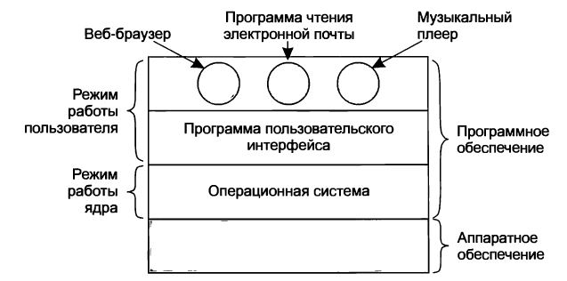
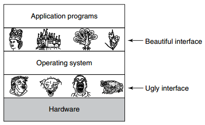

# Введение в операционные системы

```
Современный компьютер состоит из

Hardware:
.-------------------------.  .-----------------.  .-------.  .----------.  .------------.
| Процессор (1 или более) |  | Основная память |  | Диски |  | Принтеры |  | Клавиатура |
 -------------------------    -----------------    -------    ----------    ------------
.------.  .---------.  .--------------------.  .---------.  .--------------------------------.
| Мышь |  | Дисплей |  | Сетевые интерфейсы |  | Таймеры |  | Другие устройства ввода-вывода |
 ------    ---------    --------------------    ---------    --------------------------------
.------------.  .-------.   .------------.  .-----------------------.
| Микросхемы |  | Платы |   | Клавиатура |  | И другие физ. объекты |
 ------------    -------     ------------    -----------------------
```

Из этой картины возникают минимум 2 проблемы:

1) Сложно разобраться в подробностях, как все эти части компьютера работают.

2) Чрезвычайная сложность управления этими компонентами и их оптимального использования.

=> Для их решения компьютеры оснащены уровнем ПО, который называют __операционной системой__ (__ОС__).

---

Отсюда 

__DEF. ОПЕРАЦИОННАЯ СИСТЕМА__: ОС - это особая разновидность ПО, решающая 2 основные задачи:

1) Предоставить пользовательским программам более простую и ясную модель компьютера (т. е. удобные абстракции для работы).

2) Справляться с управлением указанными ресурсами Hardware (процессоры, память, диски и т.д.).

---

__Примеры ОС__:

* Windows
* Linux
* FreeBSD
* OS X (или Mac OS)
* iOS
* Android
* ...

---

Программа, с которой взаимодействует пользователь при работе с компьютером

1) оболочка (__shell__)

2) GUI

__НЕ ЯВЛЯЕТСЯ ЧАСТЬЮ ОС__, но использует ОС для своего функционирования. Пользовательские интерфейсы являются большой и важной темой, но они находятся лишь на периферии темы операционных систем.

---

Схема обсуждаемых компонентов:



На основе __hardware__ работает __ПО__.

Место ОС на данной схеме обозначает тот факт, что она 

* выполняется на hardware
* предоставляет основу для всего остального ПО.

---

Большинство компьютеров имеют 2 режима работы:

```
.---------------------------------------------------------.
| РЕЖИМ ПОЛЬЗОВАТЕЛЯ                                      |
| в нём работает остальное ПО, не входящее в ОС.          |
| Из него доступно только подмножество инструкций машины. |
| Например, в нем запрещены                               |
|     инструкции, управляющие машиной                     |
|     инструкции ввода-вывода.                            |
|-------------------------------------------------------------------------------------------------------.
| РЕЖИМ ЯДРА                                                                                            |
| ОС - самая фундаментальная часть ПО и работает в режиме ядра.                                         |
| В этом режиме она имеет полный доступ ко всему hardware компьютера и может выполнить любую инструкцию,|
| которую данная машина способна выполнять.                                                             |
 -------------------------------------------------------------------------------------------------------
```

Различие между режимом пользователя и режимом ядра играет ключевую роль в том, как функционирует ОС.

__~DEF ОС__: OC - это ПО, выполняющееся в режиме ядра (но это не всегда так).

---

_Программа пользовательского интерфейса_ (оболочка или GUI) - это __самый нижний уровень ПО пользовательского режима__. _Программа пользовательского интерфейса_ позволяет пользователю запустить другие программы - веб-браузер, музыкальный плеер и т.д. Эти другие программы также активно используют ОС.

---

### Различия между ОС и обычным ПО пользовательского режима:

1) 
```
Обычное ПО проще заменяется или даже можно     | Нельзя самому написать или поменять часть ОС
написать самому свою программу при желании     | (например, сделать свой обратчик прерываний часов,
(например, приложение для работы с электронной | являющийся частью ОС и защищенный от модификации
 почтой).                                      | пользователями со стороны hardware).
```

Это различие, однако, иногда размывается во 
* __встроенных системах__ (в которых может не быть режима ядра)
* __интерпретируемых системах__ (таких как Java, где используется интерпретация, а не железо, для разделения компонентов).

```
Во многих системах есть программы в пользовательском  | ПРИМЕР: программа, позволяющая пользователю  
режиме, которые помогают в работе ОС или выполняют    | изменить пароль (?пароль от аккаунта в ОС?). 
привелигированные функции.                            | Такая программа должна быть защищена особым
                                                      | образом.
В некоторых ОС эта идея доводится до предела, и то,   |
что традиционно считается ОСью, в них работает в      |
пользовательском режиме (например, файловая система). |
В таких системах сложно провести четкую границу - всё,|
что выполняется в режиме ядра, является частью ОС, но |
и некоторые программы вовне этого режима - тоже,      |
возможно, являются частью ОС, или, по меньшей мере,   |
тесно с ней связаны.                                  |
```

2) __Огромность, комплексность и долгое время жизни ОС в сравнении с обычным ПО__.

__*Пример*__: 

* Ядро Windows или Linux - более 5 млн строк кода.
* Windows с shared библиотеками - более 70 млн строк кода.

Поэтому у ОС долгий срок жизни - создать новую сложно и затратно. Вместо этого они эволюционируют в течение долгого времени.

__*Пример*__: 

* Windows 95 - 98 - ME (отоброшенная ветвь эволюции).
* Windows 2000 - XP - Vista - Windows 7 (современная ветвь ОС).

__*Пример*__: разновидности и клоны ОС UNIX.


UNIX - System V
     \ Solaris
	 \ FreeBSD производные на основе исходной системы
	 
Linux - свежая кодовая база ОС, смоделированная как UNIX-like и совместимая с ней.

---

## Что такое ОС?

### 1. ОС как "расширенная машина" (?)

__Архитектура__ большинства компьютеров

* система команд (_instruction set_)
* организация памяти
* система ввода-вывода
* структура шин
* ...

на уровне машинного языка примитивна и неудобна для программирования (особенно программирование ввода-вывода).

---

__*Пример*__: Жёсткие диски __SATA__ (__Serial ATA__). Для работы с такими дисками есть:

```
I. НИЗКОУРОВНЕВЫЙ ИНТЕРФЕЙС ПРОГРАММИРОВАНИЯ ЖЁСТКОГО ДИСКА SATA. 
Описание ранней версии интерфейса программирования такого диска занимает >450 страниц. Последующие 
версии - ещё сложнее.

Поэтому никакой программист не хотел бы работать с этими дисками таким способом - на уровне железа.
Это просто кошмар.

--------------------------------------------------------------------------------------------------------
II. ДРАЙВЕР ДИСКА - ПО, 

* работающее с физическим устройством 
* предоставляющее интерфейс для чтения и записи блоков диска (который удобнее, чем самый низкоуровневый)

--------------------------------------------------------------------------------------------------------
III. Абстракция "ФАЙЛ" для использования дисков. 
Даже программирование через драйвер диска является слишком низкоуровневым для большинства приложений. 
Используя эту абстракцию, программы могут создавать, записывать и удалять файлы, без необоходимости 
иметь дело с запутанными подробностями того, как в действительности работает hardware (физическое 
оборудование).
```


__ВАЖНО__: __*Данная абстракция - ключ к тому, чтобы справляться со всей этой сложностью.*__ Хорошая абстракция превращает почти нерешаемую задачу в две задачи, с которыми можно справиться:

1. Задача определения и реализации этих абстракций.
2. Задача использования этих абстракций для решения имеющейся проблемы.

__DEF. ФАЙЛ__. Абстракция "ФАЙЛ" понятна практически любому пользователю компьютера. Файл - это полезный кусок информации, например

* фотография
* сохраненное электронное письмо
* песня
* веб-страница
* ...

_Смысл в том, что_ работать с картинкой, электронным письмом, аудиозаписью гораздо проще, чем с подробностями реализации дисков SATA или дисков другого типа.
 
Работа ОС состоит в том, чтобы создавать пригодные абстракции и затем реализовывать и управлять созданными абстрактными объектами. 

Абстракции - это ключи к пониманию операционных систем.

ОС превращает ужасное железо в прекрасные абстракции, с которыми можно работать:



Реальными клиентами операционных систем являются _прикладные программы_ (написанные программистами приложений). Они напрямую работают с операционной системой и её абстракциями.

=> __Операционная система__ - _это ПО, основная цель которого - предоставление удобных абстракций для работы прикладным программам._

* ОС содержат много драйверов для работы с устройствами ввода-вывода.

### 2. Операционная система как Менеджер Ресурсов

ОС - ПО, основная задача которого - управлять всеми частями hardware, из которого состоит компьютер (см. первую схему). Т. е. предоставить упорядоченное и контролируемое выделение процессора, памяти, устройств ввода-вывода различным программам, требующим эти ресурсы.

Современные операционные системы позволяют большому количеству программ быть в памяти и выполняться одновременно.

```
ПРИМЕР 1:
Что, если три программы, одновременно попытаются распечатать свой вывод на одном и том же принтере?
Если эту ситуацию не обрабатывать, то будет полный хаос.

Что может сделать ОС?

Упорядочение: Буферизация всего вывода, предназначенного для принтера, на диск.

Когда одна программа закончила отправку своего вывода на печать, ОС может скопировать его с диска, где 
он хранится для принтера, в то время, как другая программа может продолжать генерировать ещё больше
своего вывода, не обращая внимания на то, что пока ещё этот вывод не будет отправлен данному принтеру на
печать.
```

```
ПРИМЕР 2:
Компьютер (или сеть) с более, чем одним пользователем.

В этом случае необходимость контроля и защиты памяти, устройств ввода-вывода (и проч. ресурсов) ещё
больше, так как пользователи могут в ином случае помешать работе друг друга.

Пользователи могут не только использовать общее hardware,
но и общую информацию (диски, базы данных и др.)

Здесь главная задача ОС: следить за тем, 
* какие программы какой ресурс используют
* разрешать запросы к ресурсам
* нести ответственность за использование ресурса
* быть посредником в конфликтах запросов ресурсов от разных программам и пользователей.
```

__Мультиплексирование__ ресурсов (шаринг ресурсов, обобществление ресурсов) - важный аспект менеджмента ресурсов.

```
ВРЕМЕННОЕ МУЛЬТИПЛЕКСИРОВАНИЕ РЕСУРСА            | ПРОСТРАНСТВЕННОЕ МУЛЬТИПЛЕКСИРОВАНИЕ РЕСУРСА
Разные программы или пользователи используют     | Каждый потребитель получает часть ресурса
ресурс по очереди.                               | (но не во времени, как в первом типе
                                                 |  мультиплексирования).
Определение того, как осуществляется временное   |
мультиплексирование ресурса (кто получает ресурс |
следующим и на какое время), является задачей    |
операционной системы.                            |
```

__*Пример 1*__ (временное м-е): один процессор, на котором выполняются несколько программ. Тогда ОС выделяет процессор одной программе, затем, после того, как она отработает некоторое время, процессорное выделяется другой программе и т. д.

__*Пример 2*__ (временное м-е): шаринг принтера. Есть множество задач печати в очереди для печати на одном принтере, и нужно решить, какая будет распечатана следующей.

__*Пример 3*__ (пространственное м-е): оперативная память - каждая выполняющаяся программа получает свою часть её. Предполагается, что памяти достаточно много для того, чтобы несколько программ сразу могли в ней поместиться.

Задачей ОС является обеспечение справедливости распределения памяти и её защита от доступа со стороны других программ.

__*Пример 4*__ (пространственное м-е): Дисковая память. Во многих системах единственный диск может хранить файлы многих пользователей одновременно. 

Задача ОС: выделение пространства диска и отслеживание, кто из пользователей какие блоки диска использует.

### ↑ Введение в понятие "операционная система".

