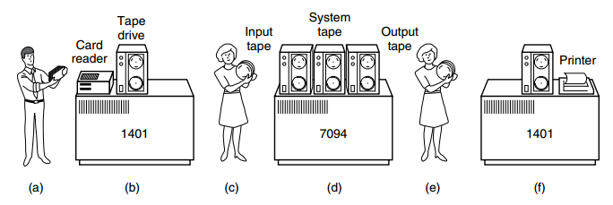
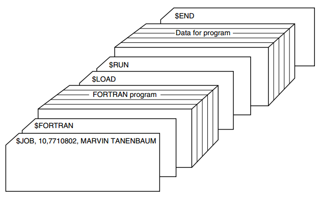

# История операционных систем

Операционные системы прошли длительную эволюцию.

__Способ периодизации истории ОС__: 

__*Поколение операционных систем*__ = _Поколение компьютеров (оборудования, hardware), на которых и для которых работают ОС_.

```
Способ такой, потому что операционные системы исторически были тесно связаны с архитектурой компьютеров,
на которых они выполнялись.

Это отображение является грубым, а не строгим. Но оно даёт классификацию, которой иначе не было бы.
```

Разные поколения имеют хронологические пересечения друг с другом и часто функционировали одновременно.

Начало - 19-й век, Бэббидж. Идея компьютера, идея ПО. Реализовать в работающем виде не удалось. У него не было и ОС для его машины.

---

## Поколение #1 (1945-1955): Вакуумные трубки

Первый работающий цифровой компьютер появился во Вторую мировую войну:

```
Джон Атанасоф, Клифорд Берри - Университет Штата Айова.

300 вакуумных трубок
```

```
Конрад Цузе - Берлин

Компьютер Z3

Сделан на основе электромеханических реле
```

```
Группа учёных, включавщая Алана Тьюринга - Блетчли Парк, Англия

Colossus
```

```
Говард Айкен - Гарвард

Mark I
```

```
Уильям Мочли, Дж. Преспер Эккерт - Университет Пенсильвании

ENIAC
```

__Из них__

* некоторые были двоичными
* некоторые использовали вакуумные трубки
* некоторые были программируемыми

но все они были примитивными и требовали секунд на выполнение простейшего вычисления.

---

__Вначале__ единственная группа людей (обычно инженеров) 

* разрабатывала, 
* изготавливала, 
* программировала, 
* эксплуатировала 
* и поддерживала 

каждую машину.

---

__Программирование__ было

* на машинном языке
* или хуже - через пересборку электрических схем, соединение тысяч кабелей к _коммутационным панелям_ для управления базовыми функциями машины.

НЕ БЫЛО никаких языков программирования, НЕ БЫЛО операционных систем.

---

__Рабочая процедура программиста__:

1. Записаться на интервал времени на (настенном) листке регистрации.
2. Вставить коммутационную панель (plugboard) в компьютер.
3. Ждать несколько часов результат, надеясь, что ни одна из десятков тысяч вакуумных трубок не перегорит в процессе работы.

---

__Область решаемых задач__: простые математические или численные вычисления, например, 

* таблицы синусов, косинусов, логарифмов
* вычисление артиллерийских траекторий.

---

Начало 1950-х годов - изобретение __перфокарт__ отчасти улучшило рутинные процессы.

Теперь программу можно было записывать и считывать с перфокарты вместо использования коммутационных панелей.

Но процедура в работе программиста осталась той же.

---

## Поколение #2 (1955 - 65): Транзисторы и пакетные системы

Середина 1950-х - появление __ТРАНЗИСТОРОВ__:

* радикальное повышение надёжности компьютеров
* возможность производства и продажи компьютеров на рынке или использования для государственных нужд.
* появление _разделения труда_ на
 * проектировщиков
 * изготовителей
 * операторов
 * программистов
 * специалистов по сопровождению компьютеров.

---

__Мейнфреймы__ - большие компьютеры в отдельных машинных залах, со штатом профессиональных операторов, появились тогда.

__Задание__ (job) - программа или набор программ для компьютера.

__Система пакетной обработки__ (batch system) - система из нескольких компьютеров, решающая проблему последовательного выполнения и получения результатов работы нескольких программ.

---

Программы писались на бумаге (например, на языке FORTRAN), потом переводились на перфокарты.

---

Схема ранней __*системы пакетной обработки*__:



Структура типичного __*входного задания*__ для _системы_:



---

Названия операционных систем:

* FMS
* IBSYS

---

Названия языков программирования: 

* Assembler
* FORTRAN

---

## Поколение #3 (1965 - 1980): Интегральные схемы и многозадачность

IBM System/360

---

## Поколение #5 (1990 - н. в.): Мобильные компьютеры

