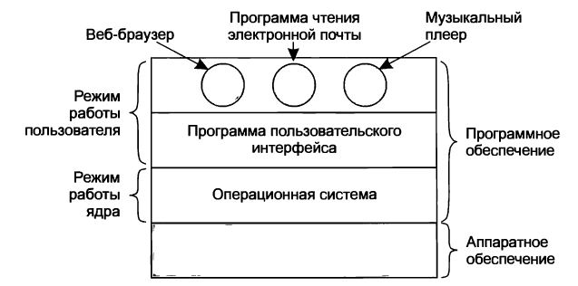

# Введение

```
Современный компьютер состоит из

.-------------------------.  .-----------------.  .-------.  .----------.  .------------.
| Процессор (1 или более) |  | Основная память |  | Диски |  | Принтеры |  | Клавиатура |
 -------------------------    -----------------    -------    ----------    ------------
.------.  .---------.  .--------------------.  .--------------------------------.
| Мышь |  | Дисплей |  | Сетевые интерфейсы |  | Другие устройства ввода-вывода |
 ------    ---------    --------------------    --------------------------------
```

Из этой картины возникают минимум 2 проблемы:

1) Сложно разобраться в подробностях, как все эти части компьютера работают.

2) Чрезвычайная сложность управления этими компонентами и их оптимального использования.

=> Для их решения компьютеры оснащены уровнем ПО, который называют __операционной системой__ (__ОС__).

---

Отсюда 

__Две основные задачи ОС__:

1) Предоставить пользовательским программам более простую и ясную модель компьютера.

2) Справляться с управлением указанными ресурсами Hardware (процессоры, память, диски и т.д.).

---

__Примеры ОС__:

* Windows
* Linux
* FreeBSD
* OS X
* ...

---

Программа, с которой взаимодействует пользователь при работе с компьютером

1) оболочка (__shell__)

2) GUI

__НЕ ЯВЛЯЕТСЯ ЧАСТЬЮ ОС__, но использует ОС для своего функционирования.

---

Схема обсуждаемых компонентов:



```
Hardware
.------------.  .-------.  .-------.  .------------.  .---------.  .-----------------------.
| Микросхемы |  | Платы |  | Диски |  | Клавиатура |  | Монитор |  | И другие физ. объекты |
 ------------    -------    -------    ------------    ---------    -----------------------
```

На основе __hardware__ работает __ПО__.

---

Большинство компьютеров имеют 2 режима работы:

```
.---------------------------------------------------------.
| РЕЖИМ ПОЛЬЗОВАТЕЛЯ                                      |
| в нём работает остальное ПО, не входящее в ОС.          |
| Из него доступно только подмножество инструкций машины. |
| Например, в нем запрещены                               |
|     инструкции, управляющие машиной                     |
|     инструкции ввода-вывода.                            |
|-------------------------------------------------------------------------------------------------------.
| РЕЖИМ ЯДРА                                                                                            |
| ОС - самая фундаментальная часть ПО и работает в режиме ядра.                                         |
| В этом режиме она имеет полный доступ ко всему hardware компьютера и может выполнить любую инструкцию,|
| которую данная машина способна выполнять.                                                             |
 -------------------------------------------------------------------------------------------------------
```

Различие между режимом пользователя и режимом ядра играет ключевую роль в том, как функционирует ОС.