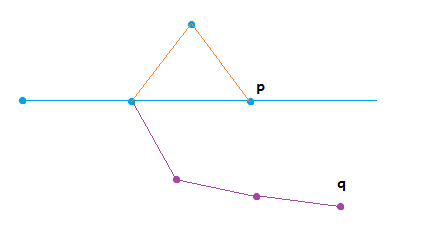

# Git

## Устройство Git изнутри

### Способ хранения файлов в Git как VCS

Сущности, с которыми работает git как VCS:

* __Объект BLOB__ - способ хранения любого файла, отслеживаемого в Git.
 * ```[BLOB]```, ```[BLOB]```, ```[BLOB]```
* __Объект Tree__ - объект, который описывает состояние файловой структуры на определенном уровне файловой системы. То, как лежат файлы.
Рекурсивная структура, может содержать в себе ссылки на объекты BLOB и объекты Tree.
 * treeObject = (```[BLOB]```, ```[BLOB]```, ```[BLOB]```)
* __Объект Commit__ - объект, который содержит в себе ссылку на treeObject и доп. метаинформацию
 * treeObject, 
 * author, 
 * committer, 
 * время, 
 * сообщение коммита
 * __*parent*__ - указатель на предыдущее состояние копии проекта в файловой системе
 
Коммит превращает в некоторый узел (node):

```
(5k4j5df4) <-- master HEAD
```

История разработки превращается в однонаправленный граф. Каждый следующий коммит указывает на своего родителя.

```
(5k4j5df4)
^
|
(9m6h4r3c)
^
|
(7y8d4u4r) <-- master HEAD
```

Это структура коммита. Никакие diff, patch нигде не хранятся.

__Ссылки__ (references) в Git. - чтобы работать с графом состояний проекта, нужны какие-то ссылки на состояния.

Типы ссылок:
* branch - ссылка (например, master - дефолтная ветка в Git), показывает на определенное состояние коммита. 
* tag

Для каждого коммита вычисляется хэш SHA-1. -> получаем таблицу "ключ-значение" для хешей и коммитов. Эта база лежит в файловой системе. Тэги нужны для того, чтобы идентифицировать это более человеческим языком - то, где мы находимся и над чем сейчас работаем.

``` 
git init shri-test
```

Инициализируется репозиторий в новой папке shri-test.

В ```.git``` есть ```refs``` и ```objects``` -- ссылки и объекты.

``` tree . -all ```

``` git cat-file -p 234k34jsdf23 ```

команда git, показать содержимое объекта по его хэшу.

`HEAD` -- это отдельный reference (ссылка), которая указывает на ссылку. Указатель на указатель. Например, `HEAD` может указывать на указатель, который указывает на ветку `master`.
`HEAD` по сути указывает на то, с какой активной веткой мы работаем. Если каждый коммит ссылается на родителя, то `HEAD` говорит о том, в какой ветке мы возьмем того родителя, коммит которого мы сейчас будем фиксировать.

``` git diff @~1 ```

как отличается текущее состояние от предыдущего от первого родителя.

``` git diff @~2 ```

---

### Rebase

```
* 6df8a36 (HEAD --> master) новый текст
| * eee2526 (feature1) фикс:)
| * 43601c4 контрибьют
|/
*   08ddf8e Привет всем
|\
| * 27c5475 коммит в ветку
* | 92de0a3 коммит в мастер
|/
* 629146e второй коммит
* 61ffb68 первый коммит
```

Надо добавить в ветку feature1 те изменения, которые есть в master. 

Для этого можно использовать и rebase, и merge. Оба подхода возможны. В чём разница?

Пусть мы влили мастер в фичу1. Пусть дальше в мастер вкоммитят новые изменения. Вольем опять их. И так несколько итераций.

В результате мы получим графовую структуру, в которой будет совершенно непонятно, откуда какое состояние возникло, как всё сливалось, как разрешались конфликты.

Поэтому есть __rebase__. 

``` git rebase master ```

Как работает rebase.

Merge не меняет историю, rebase -- переписывает историю. Это важно, если ваша команда работает через сервис типа github'a.

Куда денется ветка после rebase? Она останется, но при работе удаленными репозиториями никак не будет fetch'иться или push'иться. Со временем она может быть удалена уборщиком.

---

## Секция II. Работа с коммитами.

### Cherry-pick

Это команда, которая нужна, если мы хотим добавить к себе в ветку изменения, сделанные только в рамках некоторого выделенного коммита.

``` git cherrypick commit_hash ```



Пусть мы хотим в ветку q добавить изменения, сделанные в коммите p. Если просто выполнить команду ```cherrypick```, то будет ошибка, так как коммит p имеет двух предков и системе непонятно, какой патч нужно добавить в ветку q. Поэтому здесь для команды ```cherrypick``` нужно указать main line -- основная линия, откуда надо брать родителя, чтобы считать патч. При правильном подходе mainline -- это всегда ветка разработки. Если указать её, то результат должен оказаться именно таким, какой вы хотите.


### Отмена изменений

Что-то закоммитили в мастер и поняли, что последнем коммите у нас какая-то фигня написана. Как сделать, чтобы нашем репозитории этих изменений не было?

```{c1}``` --> ```{c2}``` --> ```{c3}``` --> {c4*}


1. __revert__ - что он делает? Он делает НОВЫЙ КОММИТ с обратным ПАТЧЕМ. 

``` git revert <hash> ```
	
Теперь в ветке мастер нет изменений, внесенных этим коммитом. В истории неправильный коммит остался. 

Сохранение таких коммитов в истории - это не всегда именно то, что нам нужно.

2. __reset__ . У него есть 3 опции

 * __--hard__ - перемещает указатель мастера на предыдущий коммит, изменения убраны, а рабочая копия будет та, что была в ```{c3}```. Левых коммитов нет.
 * __--soft__ - двигает указатель, на файловой системе остается неправильное состояние, и это неправильное состояние зависает в состоянии "индекс". Это в точности то же состояние, которое набирается перед коммитом - то, что мы готовы закоммитить. См. git add - когда мы делаем эту команду, создается BLOB и запихивается в т. н. "индекс". Т.е. мы так начинаем формировать tree object. Коммитится то, что добавлено в индекс.
 * __--mixed__ - (по умолчанию) - состояние с "неправильными" изменениями выгружается на файловую систему без добавления в индекс. Рабочей копией будет мердж предыдущего "правильного" состояния и заресеченного состояния.

Иногда может пригодиться и что-то кроме `reset --hard`.

Индекс - это tree object, в который мы записываем наши BLOB'ы.

``` git reset --hard ```

` git reset ea9023ab123cf2 --soft`

После этого команда `git status` скажет, что у нас есть изменения - что-то modified. Заресетиться можно в любое состояние (см. хэш).

__Staging__ - это то же самое, что индексирование.

``` git pull -rebase ```

``` git merge -noff ``` - слияние без fast forward.

`git reflog` позволяет увидеть как двигался HEAD относительно хэшей (коммитов) и с какого состояния на какое.

### Amend

У коммита есть опция `amend`.

```
-> {c1} -> {c2} -> {c3}
                          [current working copy]
```

Пусть мы хотим, чтобы в коммите с3 было то, что сейчас находится в рабочей копии. Тогда мы делаем `git commit -amend`. То, что было раньше в с3, остается сохраненным в системе -- его можно найти и получить через `reflog`.

### Stash

`git stash`. Пусть программист что-то разрабатывает, пишет, и тут прибегает менеджер и говорит, что всё горит, надо фиксить баг. Можно сделать `git stash` - создать "заначку", пофиксить баг, потом сделать `git stash pop` и продолжить работать.

## Секция III. Работа с удаленными репозиториями

Сложная часть, относящаяся к взаимодействию в команде.

Проблема синхронизации состояний и синхронизации с (чужими) изменениями.

Что такое Github? Это сервис для синхронизации работы с кодом. С вашим git-репозиторием. Сам по себе git является распределенной системой. Можно работать полностью локально. Но в какой-то момент бы можете захотеть синхронизироваться с тем, что сделали другие. Синхронизация в git по умолчанию - либо обмен object'ами, либо patch'ами. Патчи обычно перекидываются по почте, а объекты перекидываются синхронизацией ремоутов.

Github - это один из ремоутов.

Open-source workflow. Пусть наш проект, в нем 3 коммита и мы хотим поделиться им с сообществом:

```
{*} master,origin/master
 |
{*}
 |
{*}
```

Пушим в ремоут. Что будет с референсами в ориджине? Для этого гит создает еще один референс - называется origin/master. Он указывает туда же, куда указывает мастер после синхронизации. Ремоут (origin) выглядит так:

```
[remote]
{*} master
 |
{*}
 |
{*}
```

Появляется новый человек, который хочет улучшить наш проект на гитхабе. Что он делает? Он форкает его. То есть он копирует его себе в свой профиль на гитхабе.

```
[remote']
{*} master'
 |
{*}
 |
{*}
```

После этого он делает клон этого форка на свою локальную машину.

```
{*} master', origin/master'
 |
{*}
 |
{*}
```

Получили 4 репозитория, с которыми надо работать. Теперь начинается основная движуха. Делаем коммит в мастер:

```
{*} master'
 |
{*} origin/master'
 |
{*}
 |
{*}
```

И теперь мы хотим сделать __пулл-реквест__. Для этого мы должны сделать пуш в тот репозиторий, в который мы имеем право пушить. Этот только наш форкнутый ремоут. Делаем `git push`. Заходим на гитхаб, делаем пулл-реквест. Это чисто гитхабовская вещь. Первый разработчик, о котором шла речь, приходит и делает __approve__.

__Upstream__ - это референсный репозиторий (первый ремоут, а не наш форк). Мы хотим брать изменения референсного репозитория, иметь его структуру коммитов. Для второго разработчика origin - это его форк. Чтобы забрать изменения из upstream - 

`git remote add <upstream repo>`
	
Тогда второй разработчик имеет 2 ремоута - remote origin и remote upstream.

`git fetch`

это забрать изменения из upstream. Не `git pull`. Pull по умолчанию фетчит и мерджит. У него есть ключ `-rebase`, который ребейзит. `git fetch` просто вытягивает всю структуру проекта в ремоут-репозитории. Тогда в репозитории второго разработчика имеем

```
{*'}---{*} <-origin/master'
  \    |
   \   |
    \  |
	 {*}
      |
	 {*}
      |
	 {*}
```

На {*'} указывают master', upstream/master'. Теперь здесь есть целых три мастера.


upstream/master' - указывает на коммит, являющийся последним синхронизированным с upstream ремоутом.

origin/master' - указывает на коммит, являющийся последним синхронизированным с origin ремоутом.

После этого команда 

`git push`

запушит изменения в origin'. Цикл закончен, все репозитории синхронизированы.

---

Теперь представим, что уже есть какой-то проект...

__Правило при совместной работе__: Если мы разрабатываемся в той же ветке, которую отслеживаем из удаленного репозитория и в которой разрабатываются все остальные, то мы имеем кучу практически ненужных мерджей в ветке мастер. 

Поэтому вариант 1 - использовать pull с ключиком --rebase. Но в этом случае придется сразу же решать проблему конфликтов с изменениями на сервере. Это не хочется делать. 

Воркфлоу: никогда не разрабатываться в ветке, в которую вы пушите. У Сергеева вообще нет ветки dev. 

Как получить изменения? Просто отводим ветку, делаем в нее коммиты. Потом делаем `git pull` на мастере - приходит свежая версия. Потом делаете мердж в мастер - осознанно, пишете "Я добавил новую фичу".

Если вы не работаете через пулл-реквесты, то есть __fast-forward__ в git - если вы ответвились, а потом вливаете в мастер - _при том, что мастер между делом не изменился_ - то вместо мержда мастер просто "прокрутится" вперед на последний коммит в вашей ветке. 

Запретить fast-forward можно с помощью специального флага  __git merge -noff__. По умолчанию будет fast-forward. Чтобы понимать момент, когда ваша ветка влилась, видеть это в истории, -- надо выключать fast-forward. Тогда можно будет, например, черри-пикнуть этот коммит. Github по умолчанию при пулл-реквесте - нажатии "Merge" так и делает.

### Собачки, тильды и крышечки в git

Они вытекают из построения графа.

```
       {*}
     /  | \
  {*}  {*} {*}
  / \   |   |
{*}{*} {*} {*}
B     \ | /
       {*}
	   A (HEAD)
```

@ - сокращение для HEAD

A и B - коммиты. Как из A достучаться до B?

@^1 или @^ - это первый родитель А.

@^2, @^3 - второй и третий родители.

@~1 - первый родитель (тоже).

@~2 - первый родитель первого родителя

@^2~1 - у второго родителя А берем первого родителя.

Такие переходы довольно удобно делать при rebase'ах.

Выбор workflow в команде довольно сильно влияет на релизный цикл продукта. При подходящем воркфлоу история прозрачна и легче в ней искать места, в которых были сделаны баги. Видно, в каких местах вливались какие ветки с фичами.

Gitflow - плохо,

GithubFlow - хорошо.