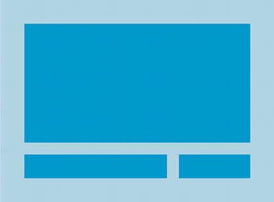

# Android

## UI


`<Buttons>` and `<TextView>` both inherit from the same Android `View` class. View - это любой элемент интерфейса.

`android.view.View` <-- `android.widget.TextView` <-- `android.widget.Button`

Свойства компонентов:

* `android:id` - имя, идентифицирующее компонент.

* `android:layout_width` - ширина компонента

* `android:layout_height` - высота.

* `android:text` - текст, отображаемый компонентом.

* `android:onClick` - задать обработчик клика.

`<Spinner>` в Android - это выпадающий список.

`<EditText>` - редактируемое текстовое поле для ввода данных --> `android.view.View`.

`<ScrollView>` - элемент для добавления полосы прокрутки для layout'а.

`<Toast>` - всплывающее окно - popup.

---

### LinearLayout

`<LinearLayout>` is used to display GUI components next to each other, either vertically or horizontally. If it’s vertically, they’re displayed in a single column, and if it’s horizontally, they’re displayed in a single row.

`android:layout_width` and `android:layout_height` attributes are __mandatory for all types of layout and view__.

You can set `android:layout_width` and `android:layout_height` to 
* `wrap_content` - you want the layout to be just big enough to hold all of the views inside it, 
* `match_parent` - you want the layout to be as big as its parent — in this case, as big as the device screen minus any padding
* `fill_parent` - deprecated,
* a specific size such as `8dp` — density-independent pixels. 

`android:orientation="vertical"` - свойство для задания расположения дочерних компонентов.

`<application android:supportsRtl="true">` - для поддержки языков, где буквы идут справа налево.

#### Padding

`<LinearLayout ... android:padding="16dp">`

```
android:paddingBottom="16dp"
android:paddingLeft="16dp"
android:paddingRight="16dp"
android:paddingTop="32dp"
```

Для языков где справа налево (API 17):

```
android:paddingStart="16dp"
android:paddingEnd="16dp"
```

#### Dimension resource file

Чтобы не было хардкодинга значений измерений:

```
<?xml version="1.0" encoding="utf-8"?>
<resources>
  <dimen name="activity_horizontal_margin">16dp</dimen>
  <dimen name="activity_vertical_margin">16dp</dimen>
</resources>
```

=> `android:paddingLeft="@dimen/activity_horizontal_margin"`

Обратиться к вьюхе можно по ее id:

```
<TextView
    android:id="@+id/text_view"
    ... />
```

#### Margin

Кроме padding есть margin, естественно.

#### Вес

`android:layout_weight="2"` - позволяет сделать так, чтобы элемент растянулся по измерениям и занял больше имеющегося свободного пространства.

#### Gravity

`android:gravity="top"` - lets you specify how you want to position the contents of a view inside the view — for example, how you want to position text inside a text field. E.g., you want the text inside a view to appear at the top.

Возможные значения _gravity_:

`top bottom left right start end center_vertical center_horizontal center fill_vertical  fill_horizontal fill`

Можно применить сразу несколько значений.

`android:layout_gravity` deals with the placement of the view itself, and lets you control where views appear in their available space.

Значения `layout_gravity`: `top, bottom, left, right, start, end, center_vertical, center_horizontal, center, fill_vertical, fill_horizontal, fill`

---

### FrameLayout

If you want a layout whose views can overlap, a simple option is to use a frame layout. Instead of displaying its views in a single row or column, it stacks them on top of each other. This allows you to, for example, display text on top of an image.

drawable resource folder is the default folder for storing image resources in your app. 

Один layout можно вложить внутрь другого. Например, 

```
<FrameLayout ...>
    <LinearLayout ... /...>
</FrameLayout>
```

Layouts and GUI components have a lot in common. All layout types have attributes in common. Whichever type of layout you use, you must specify the layout’s width and height using the `android:layout_width` and `android:layout_height` attributes. And this requirement isn’t just limited to layouts — the 
`android:layout_width` and `android:layout_height` are mandatory for all GUI components too. This is because all layouts and GUI components are subclasses of the Android `View` class.

Layout'ы - производные от `ViewGroup`, который производен от `View`. Layout - это контейнер для других View. На самом деле это дерево из View.

---

The `<include>` tag is used to include one layout inside another.

---

### Constraint Layout

Constraint'ы позволяют позиционировать элементы и задавать размеры независимо от размера экрана и ориентации.

Once you’ve added constraints to opposite sides of your view, you can control where it should be positioned relative to each side by changing its bias. 

### RelativeLayout



`RelativeLayout` is a view group that displays child views in relative positions. The position of each view can be specified as relative to sibling elements (such as to the left-of or below another view) or in positions relative to the parent `RelativeLayout` area (such as aligned to the bottom, left or center).

* Note: For better performance and tooling support, you should instead build your layout with `ConstraintLayout`.

A `RelativeLayout` is a very powerful utility for designing a user interface because it can eliminate nested view groups and keep your layout hierarchy flat, which improves performance. If you find yourself using several nested `LinearLayout` groups, you may be able to replace them with a single `RelativeLayout`.

