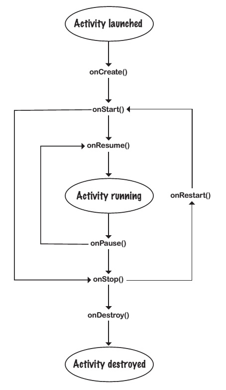

# Android

## Activity. Lifecycle.

События жизненного цикла Activity

* Создание и уничтожение
* Появление на экране на переднем плане
* Потеря фокуса и уход из вида
* Сохранение состояния активности и его восстановление.

__Your app can start an activity in another application by passing an intent with startActivity()__. The Android system knows about all the device’s installed apps and their activities, and uses the intent to start the correct activity.

__When an activity needs to start, Android checks whether there’s already a process for that app__. If one exists, Android runs the activity in that process. If one doesn’t exist, Android creates one.

__When Android starts an activity, it calls its onCreate() method__. `onCreate()` is always run whenever an activity gets created.

* How long does an activity live for?
* What happens when your activity disappears from the screen? 
 * Is it still running? 
 * Is it still in memory? 
* And what happens if your app gets interrupted by an incoming phone call? 

We want to be able to control the behavior of our activities in a whole range of different circumstances.

Тема раздела:

* Активности "под капотом"
* Ошибки приложений и способы их исправления через методы жизненного цикла активностей.

---

Если у класса активности есть поле, которое циклически изменяется каждую секунду, и нам нужно обновлять `<TextView>` его значением, то нужно сделать это таким образом, чтобы не блокировать основной поток Андроид-приложения. Только главный поток может обновлять UI, а если любой другой поток попытается это сделать, то возникнет `CalledFromWrongThreadException`.

Решение в том, чтобы использовать `Handler`.

A `Handler` is an Android class you can use to schedule code that should be run at some point in the future. You can also use it to post code that needs to run on a _different thread_ than the _main Android thread_. E.g., we can use a `Handler` to schedule the stopwatch code to run every second.

To use the `Handler`, you wrap the code you wish to schedule in a `Runnable` object, and then use the `Handler` `post()` and `postDelayed()` methods to specify when you want the code to run. 

The `post()` method posts code that needs to be run as soon as possible (which is usually almost immediately). This method takes one parameter, an object of type `Runnable`. A `Runnable` object is a job you want to run. You put the code you want to run in the `Runnable`’s `run()` method, and the `Handler` will make sure the code is run as soon as possible. 

```
final Handler handler = new Handler();
handler.post(Runnable); // You put the code you want to run in the Runnable’s run() method.
```

The `postDelayed()` method - to post code that should be run in the future. It takes two parameters: a `Runnable` and a `long`.  `long` specifies the number of 
milliseconds you wish to delay the code by. The code will run as soon as possible after the delay.
 
```
final Handler handler = new Handler();
handler.postDelayed(Runnable, long);
```

### Проблема поворота экрана устройства 

Поворот изменяет конфигурацию устройства. `portrait` --> `landscape`. При повороте текущая активность уничтожается и создается новый экземпляр активности.

Причины пересоздания Activity:

1. Система может уничтожить невидимую пользователю Activity (при нехватке ресурсов) - на телефоне может быть включена галочка "Don't keep activities".
2. Activity пересоздается при смене конфигурации системы
3. Вы сами можете пересоздать Activity

__Как повлиять на базовое укладывание активностей в стек?__ Объявление поведения активности в AndroidManifest:

```
<activity
    android:name=".MainActivity"
    android:launchMode="..."/>
```

* standard (aka multiple) - по умолчанию - когда активность может существовать в системе в множестве инстансов и добавляться в произвольный Task.
* singleTop - активность может существовать только в одном инстансе, если оно находится наверху стека.
* singleTask - в рамках одного таска должна быть одна активность
* singleInstance - незаконный - только для лончеров

Один из способов стартануть активити в новом таске - это объявить 

```
<activity
    android:name=".SecondActivity"
    android:launchMode="singleTask"
    android:taskAffinity=":second"/>
```

Что такое affinity? Что-то типа идентификатора Task'а, но посложнее. Если у вас singleTask, но не задано affinity, то оно не запустится. Через аффинити можно иметь только один дополнительный таск.

### Флаги Intent.FLAG_ACTIVITY_

```
BROUGHT_TO_FRONT
CLEAR_TASK
CLEAR_TOP
CLEAR_WHEN_TASK_RESET
EXCLUDE_FROM_RECENTS
FORWARD_RESULT
LAUNCHED_FROM_HISTORY
LAUNCH_ADJACENT
MULTIPLE_TASK
NEW_DOCUMENT
NEW_TASK - способ запустить новый таск для активити, которая не имеет launchMode=singleTask
NO_ANIMATION
NO_HISTORY
PREVIOUS_IS_TOP
NO_USER_ACTION
PREVIOUS_IS_TOP
REORDER_TO_FRONT
RESET_TASK_IF_NEEDED
RETAIN_IN_RECENTS
SINGLE_TOP
TASK_ON_HOME
```

=> не заводите Activity без веских на то причин. Управление Back Stack'ом через эти флаги -- это очень тонкий инструмент, как бы вы хорошо его ни узнали - используя его вы оставляете все на откуп системе. Флаги покрывают не все кейсы.

#### Почему одна Activity лучше нескольких

* Проще делать анимации переходов
* Можно иметь общие элементы в UI
* Легче контролировать Back Stack экранов

#### Весомые причины заводить Activity

* Разные входные точки в приложение
* Ресурсоёмкость экранов
* Одному из экранов надо перехватывать `onConfigChange`

Если не Активити, то?

_Fragments_ – классическое решение от Android

_Views_ – альтернативный подход, например, 2 библиотеки - mortar, flow от square.

__Состояния активности__

* выполняется / активное
* запущено - `onCreate()` вызов - делается нормальная настройка активности
* уничтожено - `onDestroy()` вызов - например, при смене конфигурации

Эти методы и ряд других определены в базовом классе `Activity` - содержит методы ЖЦ.

[`Context`] <-- [`ContextWrapper`] <-- [`ContextThemeWrapper`] <-- [`Activity`]

__Context abstract class__ (`android.content.Context`)
* An interface to global information about the application environment. Allows access to application resources, classes, and operations.

__ContextWrapper class__ (`android.content.ContextWrapper`)
* A proxy implementation for the `Context`.

__ContextThemeWrapper class__ (`android.view.ContextThemeWrapper`)
* Allows you to modify the theme from what’s in the `ContextWrapper`.

__Activity class__ (`android.app.Activity`)
* The `Activity` class implements default versions of the lifecycle methods. It also defines methods such as `findViewById(Int)` and `setContentView(View)`.

Для сохранения состояния приложения при повороте экрана, нужно реализовать метод

```
@Override
public void onSaveInstanceState(Bundle savedInstanceState) {
    savedInstanceState.putInt("seconds", seconds);
    savedInstanceState.putBoolean("running", running);
}
```

который вызывается перед уничтожением активности. `Bundle` доступен как параметр в методе `onCreate()` жизненного цикла. Также он может пересылаться между разными процессами.

There are three key lifecycle methods that deal with when an activity becomes visible or invisible to the user:

* `onStart()` gets called when your activity becomes visible to the 
user.  

* `onStop()` gets called when your activity has stopped being visible to the user. This might be because it’s completely hidden by another activity that’s appeared on top of it, or because the activity is going to be destroyed. If `onStop()` is called because the activity’s going to be destroyed, `onSaveInstanceState()` gets called before `onStop()`.
* `onRestart()` gets called after your activity has been made invisible, before it gets made visible again.

An activity has a state of stopped if it’s completely  hidden by another activity and isn’t visible to the user. The activity still exists in the background  and maintains all state information.

If you override any of the `Activity` lifecycle methods in your activity, you must call the superclass method or Android will give you an exception.

There’s one more situation we need to consider: when an activity is visible but doesn’t have the focus. In this case, the activity is paused. This can happen if another activity appears on top of your activity that isn’t full-size or that’s transparent. The activity on top has the focus, but the one underneath is still visible and is therefore paused.

There are two lifecycle methods that handle when the activity is paused and when it becomes active again: 
* `onPause()` gets called when your activity is visible but another activity has the focus. 
* `onResume()` is called immediately before your activity is about to start interacting with the user. 

Активность может быть paused, и одновременно может произойти поворот устройства.



If you have an activity that’s visible, but never in the foreground and never has the focus, the `onPause()` and `onResume()` methods never get called.

When the activity is resumed, the activity’s `onResume()` lifecycle method is called. If the activity is started, the activity’s `onResume()` method is called after calling `onStart()`. The `onResume()` method is called irrespective of whether the activity is resumed or started, which means that if we move our `onStart()` code to the `onResume()` method, our app will behave the same irrespective of whether the activity is resumed or started. 

When the activity is paused, the activity’s `onPause()` lifecycle method is called. If the activity is stopped, the activity’s `onPause()` method is called prior to calling `onStop()`. The `onPause()` method is called irrespective of whether the activity is paused or stopped. Так как система может убить процесс, всё критичное должно быть сохранено в методе `onPause()`. Также такое может произойти в `onDestroy()`, и после этого `onDestroy()` вызов не гарантирован.

---

Activity пересоздается при повороте экрана -- при смене конфигурации.

Есть способ восстановления приложения в случае "убийства" его системой + восстановление при смене конфигурации (например, поворот экрана). Можно сделать общее решение для обоих случаев -- плюс в том, что не надо дважды писать код, выполняющий сходные задачи. И просто поворачивая экран, вы отлаживаете более редкий кейс с убийством приложения.

---

`android.app.Activity` используется только для представления данных

* Activity не грузит сама данные для представления
* Activity не управляет сама асинхронными операциями

---

Как работать с пересозданием Activity?

Есть 3 способа что-то передать между пересоздающимися Activity:

* Сохренение - Поля Activity
* Сохранение - Состояние View Hierarchy
* Только для случая смены конфигурации - несериализуемые данные

Для сохранения и восстановления полей вместо работы с `onSaveInstanceState()` и `Bundle` применяется библиотека icepick.

_Восстановление View Hierarchy_

* View должно иметь id
* View восстанавливается после `Activity.onCreate()`

---

Несериализуемые данные

* Это примитивы и вообще те объекты, которые не реализуют ни `Serializable`, ни `Parcelable`
* Большие объекты (в `Bundle` есть ограничения на размер сериализуемых данных)
* `Thread`

Способы работы с ними (как передать несериализуемые данные между активностями / в активность при смене конфигурации): 

1) Использовать `RetainedFragment`.

2) Loader - для задач "просто получить данные" (считать из БД или по запросу по сети) предпочтительный вариант. Но если у вас процесс с периодической передачей промежуточных результатов, то лучше фрагмент publishProgress.

3) NonConfigurationInstance / CustomNonConfigurationInstance.

4) Static singleton

5) Application

