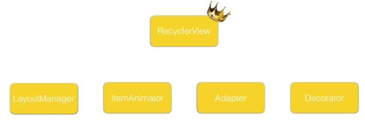
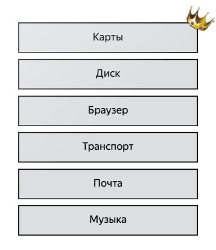
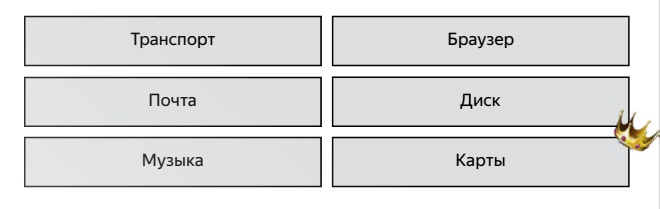
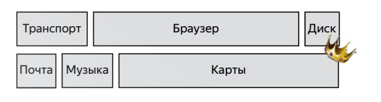
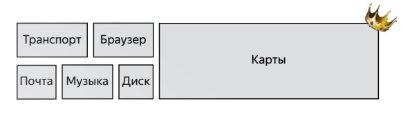

# Android

## AdapterView, RecyclerView

`AdapterView` - это то, что было до `RecyclerView` и это было общим названием для клевых view типа `GridView`, `ListView` и т.д.

`ListView` устарел, его стоит использовать только для очень простых случаев.

`ListView` - для отображения списков одинаковых элементов (или не одинаковых, но сходных). Длина списка мб очень большой или даже бесконечной.

До этого был `ScrollView`. Подойдет для списков из максимум сотен элементов. Но для него нужно слишком много ресурсов. -> `OutOfMemoryException`.

Как решается проблема ресурсов: 

* Создается столько view, сколько вмещается на экран*
* Новые view не создаются, а переиспользуются старые.

_Adapter_ - краеугольный камень `ListView`.

* Создавал и заполнял элементы по требованию
* Позволял переиспользовать View разных типов
* В паре с `ListView` имел очень простое API.

---

Со временем задачи усложнились, layout'ы усложнились --> Google запилил `RecyclerView`.

Устройство `RecyclerView`:



* `LayoutManager` отвечает за размещение view.
* `ItemAnimator` отвечает за анимацию view.
* `Adapter` создает элементы и задает в них данные (новые данные, если нужно)
* `Decorator` дорисовывает ваши элементы до того состояния, которое вы хотели. Например, как в `ListView` нарисовать selection одного или нескольких элементов. Можно нарисовать для элементов все, что угодно.

`RecyclerView` занимается управлением всеми ними.

```
<android.support.v7.widget.RecyclerView
    android:id="@+id/artistsList"
    android:layout_width="match_parent"
    android:layout_height="match_parent"/>
```

---

### LayoutManager

* `LinearLayoutManager`



* `GridLayoutManager`



* `StaggeredGridLayoutManager` - позволяет выставлять разный span для разных элементов:



или (не только по длине, но и по высоте)



`RecyclerView` отвечает за скроллинг. И `LayoutManager` отвечает за скроллинг. При этом `RecyclerView` обрабатывает взаимодействие пользователя с экраном - touches, flings, и сообщает `LayoutManager`, на сколько нужно проскроллить. Как только `LayoutManager` не может проскроллить, `RecyclerView` перестает ему слать сообщения. Вот так работает скроллинг.

`LayoutManager` также отвечает за 

* Accessibility - доступность для людей с ограниченными возможностями.
* View Focusing - это то, что исчезло из `ListView` - selection. Теперь, когда вы говорите какой-то view сфокусироваться, `RecyclerView` получает об этом информацию, говорит о желаемом `LayoutManager`'у и `LayoutManager` сам ищет элемент, который подходит под нужные требования.

В коде `Activity`:

```
final RecyclerView recyclerView = findViewById(R.id.artistsList);
recyclerView.setLayoutManager(new LinearLayoutManager(this));
```

---

### Adapter

Отвечает за всё то же, что в `ListView`, и вдобавок ещё.

* Создание `ViewHolder`’ов 
* Заполнение `ViewHolder`’ов информацией
* Уведомление `RecyclerView` об изменении данных - нельзя поставить на recycler `itemClickListener()`.
* Обработка касаний
* Управление количеством `ViewType`’ов
* Информация о переиспользовании ViewHolder
* Частичное обновление данных

API Adapter'a

Есть метод `notifyDatasetChanged()`, но его лучше не использовать. Лучше `notifyItemX()` - нужен для того, чтобы __анимировать__ (см. Анимация; есть простой дефолтный аниматор, а также можно написать свой) элементы, которые изменяются, удаляются, перемещаются, добавляются.

С этими методами можно управлять данными на экране как угодно и очень точно.

Код в Activity:

```
private ArtistsListAdapter adapter; // поле класса активности

final ArtistsListActivity self = this;
adapter = new ArtistsListAdapter(self, Artists.List);
adapter.setClickListener(self);
recyclerView.setAdapter(adapter);
```

Класс адаптера:

```
public class ArtistsListAdapter extends RecyclerView.Adapter<ArtistsListAdapter.ViewHolder> {
    private List<Artist> mData;
    private LayoutInflater mInflater;
    private ItemClickListener mClickListener;
	
    // data is passed into the constructor
    public ArtistsListAdapter(Context context, List<Artist> data) {
        this.mInflater = LayoutInflater.from(context);
        this.mData = data;
    }
	
    // inflates the row layout from xml when needed
    @Override
    public ViewHolder onCreateViewHolder(ViewGroup parent, int viewType) {
        View view = mInflater.inflate(R.layout.artist_list_item, parent, false);
        return new ViewHolder(view);
    }
	
    // binds the data to the TextView in each row
    @Override
    public void onBindViewHolder(ViewHolder holder, int position) {
        Artist artist = mData.get(position);
        holder.artistNameTextView.setText(artist.name);
        holder.artistGenresTextView.setText(artist.genres.length > 0 ? artist.genres[0]: "");
    }
	
    @Override public int getItemCount() { return mData.size(); } // total number of rows
	
    // stores and recycles views as they are scrolled off screen
    public class ViewHolder extends RecyclerView.ViewHolder implements View.OnClickListener {...}
	
    // allows clicks events to be caught
    public void setClickListener(ItemClickListener itemClickListener) {
        this.mClickListener = itemClickListener;
    }
	
    // parent activity will implement this method to respond to click events
    public interface ItemClickListener {
        void onItemClick(View view, int position);
    }
}
```

---

### Пример ViewHolder'a


```
public class ArtistsListAdapter extends RecyclerView.Adapter<ArtistsListAdapter.ViewHolder> {
    // stores and recycles views as they are scrolled off screen
    public class ViewHolder extends RecyclerView.ViewHolder implements View.OnClickListener {
        TextView artistNameTextView;
        TextView artistGenresTextView;

        ViewHolder(View itemView) {
            super(itemView);
            artistNameTextView = itemView.findViewById(R.id.artistName);
            artistGenresTextView = itemView.findViewById(R.id.artistGenres);
            itemView.setOnClickListener(this);
        }

        @Override
        public void onClick(View view) {
            if (mClickListener != null) {
                mClickListener.onItemClick(view, getAdapterPosition());
            }
        }
    } /// продолжение кода ArtistsListAdapter
}
```

---

### Анимация в Recycler View


