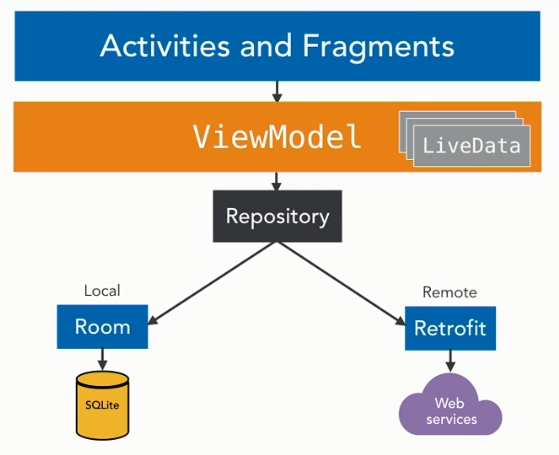

# Android

## Architecture Components

Architecture Components - набор открытых библиотек, которые могут помочь вам с построением ваших приложений.

Пример - приложение для записи заметок.

Экраны - активити

### Подход к архитектуре Android-приложения

* Активити и фрагменты - это __презентационный уровень__.
* Бизнес-логика - __ViewModel__ (работа с данными, находящимися в памяти). `SomeActivity` --> `SomeViewModel`. ViewModel устойчива к смене конфигурации -> для нее нужно много работать с событиями жизненного цикла.
* __LiveData__ - для работы с данными в памяти. Это "издатель", на обновления которого можно подписаться из презентационного уровня. Тогда презентационный уровень будет реагировать на изменения данных.
* Управление БД - компонент __Room__. Room разработана для работы с компонентами LiveData и ViewModel, но может использоваться отдельно от них. Entity -- database access object.

Отношения между компонентами:

__*Repository*__ не является частью AC, но это устоявшийся паттерн для работы с данными - непосредственно с источниками этих данных. 

В этом и состоит идея разделения ответственности.

Также есть следующие ACs:

* __LifecycleOwner__ - для работы с событиями ЖЦ активити. Устранить бойлерплейт.

* __Paging library__ - для пагинации при больших объемах данных.

* __Data binding library__ - для сложных интерфейсов, MVVM.
