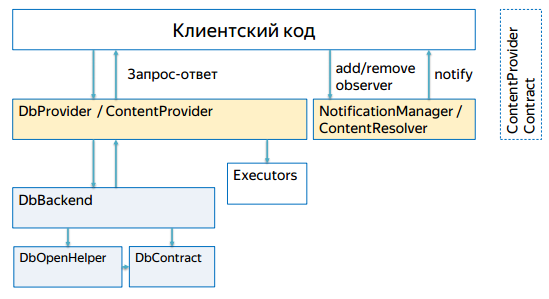

# Android

## Базы данных и SQLite

Создание таблицы в SQLite

```sql
CREATE TABLE learners (
    id INTEGER PRIMARY KEY,
	name TEXT UNIQUE NOT NULL, // возможно, здесь стоит сделать индекс по имени
	phone TEXT
);
```

Даже если не определить первичный ключ, система создаст его за вас и индекс по нему. Если вы определите его сами (см код), то вы создаёте его псевдоним с указанным именем. Можно просто пользоваться встроенным id-шником.

Для передачи апострофа в строку нужно экранировать его ещё одним апострофом:

```sql
INSERT INTO artists (name,image )
VALUES ('O''Nile', 14);
```

Еще есть проблема, что можно в строку вставить число.

ID строки, который SQLite создаёт за вас, называется `rowid` и он принимает целые значения от 1.

### Функции sqlite

`ifnull()`

```sql
SELECT name, ifnull(image, '<no image>')
FROM artists;
```

`random()` - случайное целое, мб отрицательным.

`group_concat()` - конкатенация строк при `GROUP BY`.

---

В SQLite можно работать одновременно с несколькими БД. Например, соединять таблицы из двух РАЗНЫХ БД:

```sql
ATTACH DATABASE 'database2.sqlite' AS db2;
```

После этого для DML DDL операций используем префикс `db2.`. И работает.

### Транзакции БД

В sqlite есть транзакции

```sql
BEGIN TRANSACTION;

INSERT INTO db2.images
SELECT * FROM images;

INSERT INTO db2.artists
SELECT * FROM main.artists;

END TRANSACTION;
```

Есть ROLLBACK.

### VACUUM

Если в файл БД добавить много данных, а потом удалить их, то размер файла не уменьшится. Для решения этой проблемы есть команда `VACUUM`. Она пересобирает базу целиком.

```sql
VACUUM;
```

Проблема в том, что в течение ее работа с БД заблокирована.

---

## SQLite в Android API

Структура SQLite в Андроид на примере одного запроса.

```sql
select my_column 
from my_table
where column1 = value;
```

Выбираем какие-то данные из таблицы. Тогда мы создаем курсор с запросом и вызываем функцию `query()`

```java
Cursor cursor = db.query("my_table", new String[] {"my_column"}, "column1=?", new String[] {"value"});
```

`db` имеет тип `SQLiteDatabase`. Функция `SQLiteDatabase#query()` не выполняет запрос, а только формирует его и хранит его в объекте `SQLiteQuery`.

Запрос не будет выполнен, пока не будет вызвана функция

```java
cursor.moveToFirst();
```

или `getCount()` и т.п.

Запрос выполнится и это приведет к тому, что часть данных будет скопирована в память. Выполнится внутренняя функция `SQLiteCursor#fillWindow()`, которая выполнит запрос и какой-то кусок данных угонит в память. Курсор -- это итератор с кэшем (1-2МБ). Выходите за границы кэша - прифетчивает еще 1-2МБ.

Что делает функция `SQLiteCursor#fillWindow()`? Всё проходит через некую сессию `SQLiteSession` - сессия - это такой объект, который соответствует каждому потоку. Сессия пытается получить соединение (`SQLiteConnection` через `SQLiteConnectionPool`) - `SQLiteConnection.java` и `SQLiteConnection.cpp` - нативная часть, где самое важное и происходит.

Что важно при разработке на Андроид с использованием sqlite?

* Знание и использование SQLite Android API (и по минимуму SQL запросов) 
* Организация многопоточности - если нужно считывать и записывать данные одновременно, вам нужно создать класс (или еще что-то), который будет это обрабатывать.
* Сделать прозрачную структуру классов - очень часто берут один класс и `SQLiteOpenHelper`, и пихают весь функционал, работающий с БД. Это можно если база данных простая.

### Функции модуля, работающего с БД, которые должны быть вами реализованы



Их не так много. Это функциональная структура работы модуля БД.

__Клиентский код__ - ничего не знает о БД; просто вызывает "хочу что-то" у какого-то провайдера. 

__Провайдер__ / __Notification Manager__ - это фасад для клиентского кода, клиент работает с ним. Провайдер предоставляется данные или принимает команды на их изменение, Notification Manager вызывает коллбэки, когда данные изменились.

Работа с БД на самом деле содержится в __DbBackend__. Он хранит запросы. Он связывается с __DbOpenHelper__, когда ему нужно сделать запрос. И есть какой-то контракт __DbContract__ - это набор констант, который вы используете (имена таблиц, столбцов и тд). + Возможно, скрипты запросов или их куски в виде констант. Обычно делают константы прямо внутри OpenHelper

__DbProvider__ может фактически быть Content Provider'ом + Content Resolver (те же нотификации, уже готовые).

__DbOpenHelper__

* Отвечает за версионность БД (версии вашей структуры БД; если она изменяется, то...)
* Выполняет скрипты создания и обновления схемы и данных

* `private static final int VERSION`
* `onCreate()` - задаете здесь скрипт создания
* `onUpgrade()` - скрипт обновления
* `onDowngrade()` - вместо этого просто можно изменить версию и вызвать `onUpgrade()`
* `onConfigure()` - обычно выполняет `PRAGMA ...; PRAGMA ...`.

__DbBackend__ - это рабочая лошадка, делает все запросы
* Выполняет все нужные запросы
* Синхронный - не знает ничего о потоках - его вызвали на каком-то потоке, он на нем и отрабатывает.
* Покрывается тестами удобно через JUnit.

__DbProvider__ - отвечает за потоки
* Выполняет функции __DbBackend__ на правильном потоке. Например, из главного потока вызовет в другом потоке, и вернет коллбэк. Или если это не UI поток, то работает прямо в нем.
* Реализует внешний интерфейс для клиентского кода (клиент ни о чем кроме него или __NotificationManager__'a не должен знать)
* Дергает __NotificationManager__ после обновления данных

__NotificationManager__
* Хранит список слушателей, которых он оповещает (add/remove observer)
* Дергает каллбеки слушателей на главном потоке
* Реализует логику подписки с параметрами - например, recyclerView1 подписан на обновления Т1, а recyclerView2 на обновления T2 и их не надо дергать, если обновились не их данные. Это логика может быть задана через Нотификейшн Менеджер.

---

С чего начать работу с БД? Чтобы не впадать в ступор.

* Выясняем требования к хранимым данным - "рисуем таблички со связями"
* Выясняем требования клиентского кода - например, кто-то уже написал RecyclerView, которые запрашивает данные через AsyncTask, и вы подстраиваетесь под это. А если этого нет, то сами устанавливаете способ работы и навязываете его другим.
* Разрабатываем структуру БД
* Пишем __DbOpenHelper__ - это начало кодинга. Структура есть - пишите запросы на создание таблиц, ставите VERSION = 1 и дальше пошло-поехало:
* Реализуем каждую функцию в связке __DbProvider__ <-> __DbBackend__, вносите в них по очереди все функции, нужные клиентскому коду

Хороший подход, если в __DbBackend__ одна публичная функция на "транзакцию". Допустим, есть сложное изменение данных, где одно логическое изменение - 
это несколько изменений в таблицах. Тогда вы в функции начинаете и заканчиваете транзакцию. Это очень понятно и все так делают.

Нужно ли закрывать БД? Если вы на 100% знаете, что работа с ней завершилась, то да. А иначе - нет. Люди грешат вызовом метода закрытия. Если приложение умрет, то sqlite обработает эту ситуацию (см. транзакции).

---

Инструмент тестирования работы с БД - __Robolectric__. Он создает sqlite БД в памяти и вы реально работаете с ней.