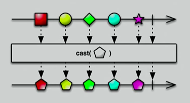
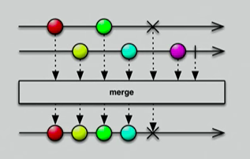

# RxJava

Для Java на Android стандартные подходы для взаимодействия потоков - 

* `Handler`
* `AsyncTask`
* `Loader`
* `Service`

Другие подходы

* Robospice
* EventBus
* Bolts от Facebook
* Rx

Реактивное программирование - это не просто библиотека, это целая парадигма. Есть её реализации для разных платформ и языков. Для маленьких локальных задач типа загрузки картинки применять его особого смысла нет.

Суть реактивного программирования - данные представляются не как статические блоки типа полей в классах, а как "потоки", эволюционирующие во времени. В этом подходе получается, что пока данные идут по потоку, на них можно накладывать некоторые операции - их можно трансформировать, изменять. Во-вторых, эти потоки можно накладывать друг на друга.

Реактивное программирование очень хорошо сочетается с функциональным программированием. Там тоже нет данных в классах, а есть переходы от функции к функции.

"Потоки" легко модифицировать, переключать их контекст.

В __Rx__ (__Reactive Extension__) есть 2 штуки -


`Observable` - излучает данные

`Observer` - наблюдатель, получатель данных. Методы Observer'a:
* `onNext(T)` - вызывается каждый раз при публикации нового события в заданном Observable. В нем предпринимаются действия в ответ на событие - это самая интересная часть кода.
* `onCompleted(T)` - при завершении последовательности событий от Observable - указывает на то, что onNext(T) больше не будет вызван.
* `onError(Throwable t)` - при возникновении исключения. После него onNext() и onCompleted() никогда не будут вызываться.

Observable не отдает данные, пока на него не подпишется хотя бы 1 Observer.

Observable может быть в трех состояниях - он либо излучает данные, и у Observer'a вызывает метод `onNext()` - "держи данные", и 2 конечных состояния - "я закончил работу и  OK" - `onCompleted()`; `onError()` - закончил работу с ошибкой, в метод придет исключение.

Этот поток очень легко изменять - есть операторы, которые можно накладывать на потоки. Можно накладывать на один поток и получать другой результирующий поток. Можно комбинировать 2 потока и получать результирующий.

Основные операторы -

### Фильтрующие операторы


У нас есть поток данных, по нему излучаются данные через Observable, и мы хотим получить данные определенного типа или большие некоторого значения - т.е. некоторое условие. Накладываем этот оператор и в результирующем потоке в Observer'e получаем только данные, удовлетворяющие этому условию.

```java
Observable.from(artistList) // это способ создать Observable из списка данных
    .filter(artist -> artist.getTracks().size() > 0) //  оператор фильтр с условием
	.subscribe(/* ... */) // подписка, в которой имеем данные, удовлетворяющие условию
```

Фильтрующий оператор выбирает подмножество из данного множества данных. Оно имеет тот же тип, что первое множество.

Если вы решили использовать в проекте Rx, то многое придется переделать. Например, где раньше возвращали JSON, теперь нужно будет возвращать `Observable` на JSON.

### Трансформирующие операторы



Оператор берет множество данных и возвращает множество из того же количества данных, но уже другого типа.

```java
loadJson().map(json -> {/* ... */}) // loadJson() возвр. Observable на JSON
    .filter(artist -> artist.getTracks().size() > 0) // map позволяет из json сделать список артистов
	.subscribe(/* ... */) // Дальше известный фильтрующий оператор
```

### Комбинирующие операторы

Если нужно скомбинировать несколько операций - например, сначала трансформировать, потом отфильтровать.



Эти операторы применяются для НЕСКОЛЬКИХ потоков данных. Например, оператор merge берет 2 потока с данными и создает результирующий поток, в котором находятся все данные из первых двух потоков.

```java
Observable.merge(
   artistsFromCloudStorage(), 
   artistsFromLocalStorage()
).subscribe(/* ... */);
```

можно работать с данными из разных источников, и удобным образом!

## Scheduling

Шедулинг - наверно, главный плюс реактивного программирования. Это переключение ваших операций на разные потоки.


Пусть, например, вы хотите сделать одну операцию в сильно приоритетном потоке, а другую - просто в стандартном новом потоке, и она менее важная.

```java
Observable.merge(
   artistsFromCloudStorage(), 
   artistsFromLocalStorage()
)
.subscribeOn(Schedulers.io()) // в этом методе вы указываете шедулер
.observeOn(AndroidSchedulers.mainThread())
.subscribe(/* ... */);
```

В Rx есть набор шедулеров - стандартные Schedulers, есть AndroidSchedulers, для которых можно указать Handler, Looper, mainThread. Можно сделать свой шедулер и передать.

Когда вы вызываете метод `subscribeOn()` и передаете туда какой-то шедулер, то первая операция будет совершаться на этом шедулере. То есть получение данных из клауда или локала будет на этом шедулере.

Если вы вызываете метод `observeOn()`, то всё, что ниже по цепочке, будет выполняться на указанном шедулере. 

### Подписка

Важная вещь, чтобы не было утечек памяти.

Когда вы подписываете Observable на какой-то результат, вам возвращается подписка Subscription.

```java
public class RxActivity extends Activity {
  @Nullable private Subscription mSubscription;
  @Override
  protected void onStart() {
    mSubscription = Observable.create( /* ... */ )
      .subscribeOn(Schedulers.io())
      .observeOn(AndroidSchedulers.mainThread()) 
      .subscribe( /* ... */ );
  }
  @Override
  public void onStop() {
    super.onStop();
    if (mSubscription != null) 
	  mSubscription.unsubscribe(); // вся цепочка операций отписывается при прекращении работы активити 
        	  // - нет утечек.
  }
}
```

`CompositeSubscription` - контейнер для подписок

```java
public class RxActivity extends Activity {
  private CompositeSubscription mCompositeSubscription = new CompositeSubscription();

  @Override
  protected void onStart() {
    Subscription subscription = Observable.create( /* ... */ )
      .subscribeOn(Schedulers.io())
      .observeOn(AndroidSchedulers.mainThread())
      .subscribe( /* ... */ );
    mCompositeSubscription.add(subscription);
  }
  @Override
  public void onStop() {
    super.onStop();
    mCompositeSubscription.unsubscribe();
  }
}
```

Кроме unsubscribe(), которые отписывает не только текущие, но и будущие подписки, есть метод `clear()`, отписывающий текущие подписки, но не будущие.

###  Обработка ошибок

Метод `onError()` - возвращается ошибка, которая была на каком-то участке цепочки, которая была пока данные шли. Эта ошибка придет в подписчика. Это очень круто, в других механизмах с этим туго.

---

RX – готовое решение с полным набором возможностей, целая парадигма, требующая от вас писать код определенного типа.

---

[знаешь чем отличается zip от flatMap и умеешь их использовать]
