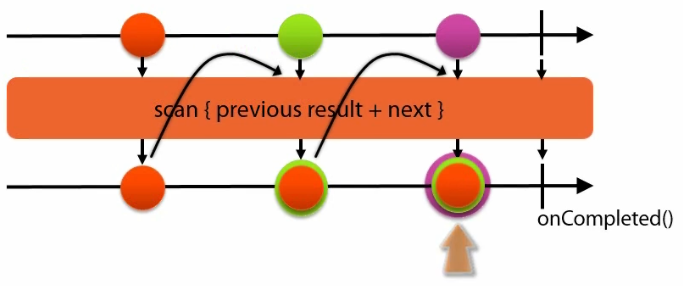
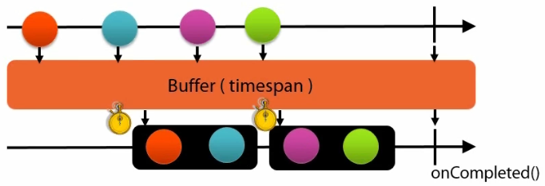

# RxJava

## Observable. Трансформации

Трансформации, вход: события из потока событий

Выход - трансформированные события из потока -> в одно событие или много событий.

### Трансформации - отображение (mapping)

__map()__ - Отображение 1-к-1: событий типа Т1 -> в событие типа T2.

Элементы потока последовательно трансформируются, после чего вызовется onCompleted().

У некоторых трансформаций есть onError, который тоже можно обработать.

```java
Observable.from(DataGenerator.generateGreekAlphabet())
    .map(letterStr -> letterStr.toUpperCase())
	.subscribe(letterStr -> System.out.println(letterStr));
```

__flatMap()__ - отображение 1-к-много: событие типа Т -> в события типа Т1, Т2, ...

Опять же элементы потока последовательно трансформируются, после чего вызовется onCompleted().

```java
Observable.from(DataGenerator.generateGreekAlphabet())
    .flatMap(letterStr -> {letterStr.toUpperCase(), letterStr.toLowerCase()})
	.subscribe(letterStr -> System.out.println(letterStr));
```

После этого __flatMap()__ получаем поток из вдвое большего числа элементов.

### Трансформации - Scanning

__scan()__. Позволяет передавать состояние вперед от события к событию - и поэтому является мощным. 



```java
Observable.from(DataGenerator.generateGreekAlphabet())
    // 1-й параметр - начальное значение для аккумулирования
	// 1-й параметр лямбды - данные, которые вы хотите передать от одного onNext() вызова к другому onNext()
	// 2-й параметр лямбды - данные для данного прохода операции scan()
    .scan(new StringBuilder(), (accumBuffer, nextLetter) -> accumBuffer.append(nexLetter))
	.subscribe(total -> System.out.println("Scan event: " + total.toString()));

Observable.from(DataGenerator.generateGreekAlphabet())
    .scan(new StringBuilder(), (accumBuffer, nextLetter) -> accumBuffer.append(nexLetter))
	.last()
	.subscribe(total -> System.out.println("Scan event: " + total.toString()));
```

Результат вызова первой трансформации:

```
Scan event: 
Scan event: Alpha
Scan event: AlphaBeta
Scan event: AlphaBetaGamma
...
Scan event: AlphaBetaGamma.................Omega
```

Здесь мы получим результаты вызова для каждого промежуточного этапа.

Результат вызова второй трансформации:

```
Scan event: AlphaBetaGamma.................Omega
```

Только последний результирующий элемент.

### Трансформации - Group By

Аналогично GROUP BY из SQL.

Группировка по четности-нечетности:

```java
Observable.from(DataGenerator.generateBigIntegerList())
    .groupBy(i -> 0 == (i % 2) ? "EVEN": "ODD")
	.subscribe(groupList -> { // Observable<GroupedObservable<String, Integer>>.subscribe(...)
	    System.out.println("Key: " + groupList.getKey());
		
		groupList.subscribe(x -> System.out.println(groupList.getKey() + ": " + x))
	});
```

Результат работы кода:

```
Key: EVEN
EVEN: 0
Key: ODD
ODD: 1
EVEN: 2
ODD: 3
EVEN: 4
...
```

здесь сохраняется порядок приходящих событий, что несколько противоречит тому, что мы могли ожидать.

Для того, чтобы сначала вывести все четные числа подряд, а потом - все нечетные, надо переделать код:

```java
final ArrayList<Integer> evenList = new ArrayList<>();
final ArrayList<Integer> oddList = new ArrayList<>();

Observable.from(DataGenerator.generateBigIntegerList())
    .groupBy(i -> 0 == (i % 2) ? "EVEN": "ODD")
	.subscribe(groupList -> { 
		groupList.subscribe(x -> {
			if (groupList.getKey().equals("EVEN")) {
			    evenList.add(x);
			} else {
			    oddList.add(x);
			}
		})
	});
	
System.out.println("EVEN:");
evenList.forEach(num -> System.out.println(num));
System.out.println("ODD:");
oddList.forEach(num -> System.out.println(num));
```

### Трансформации - Buffer

В течение заданного timespan накапливает элементы в буфер:



```java
TimeTicker ticker = new TimeTicker(100); // срабаотывает каждые 100мс
ticker.start();

ticker.toObservable()
    .buffer(1, TimeUnit.SECONDS) // буферизовать в течение 1с и потом из этого буфера генерируется событие
	.subscribe(list -> { // список сгенеренных long-значений
	    int count = 1;
		int size = list.size();
		for (int i = 0; i < size; i++)
		    System.out.println("" + (count++) + ": " + list.get(i));
	});
	
ThreadUtils.sleep(5000);
ticker.stop();
```

На выходе получим 5 раз по списку из 10 long значений таймстэмпов. 


---

## Условные операции

С их помощью можно контролировать один поток событий, используя другой поток событий как спусковой крючок.

__Пример #1__: Вывести значение по умолчанию, если поток событий пустой:

```java
Observable.empty()
    .defaultIfEmpty("Hello World")
	.subscribe(s -> System.out.println(s));
```

```java
Observable.from(DataGenerator.generateGreekAplhabet())
    .defaultIfEmpty("Hello World")
	.first()
	.subscribe(s -> System.out.println(s));
```

Во втором случае список не пуст, поэтому это будет не значение по умолчанию.

__Пример #2__: Пропустить все числа, которые меньше восьми:

```java
Observable.from(DataGenerator.generateFibonacciList())
    .skipWhile(i -> i < 8)
	.subscribe(i -> System.out.println(i));	 
```

__Пример #3__: Получить все числа, которые меньше восьми:

```java
Observable.from(DataGenerator.generateFibonacciList())
    .takeWhile(i -> i < 8)
	.subscribe(i -> System.out.println(i));	 
```

__Пример #4__: Получить все числа, индекс которых удовлетворяет некоторому условию:

```java
Observable.from(DataGenerator.generateFibonacciList())
    .takeWhileWithIndex((i, index) -> index < 3)
	.subscribe(i -> System.out.println(i));	 
```

__Пример #5__: Условные операторы временными условиями или с условиями гонки.

__Ambiguous operator__ - принимает 2 observable, и возвращает тот observable со всеми его событиями, который первым сгенерит событие.

Сгенерировать последовательность греческих букв с некоторым интервалом, и последовательность английских букв с вдвое большим интервалом

```java
TimedEventSequence<String> sequence1 = 
	new TimedEventSequence<>(DataGenerator.generateGreekAlphabet(), 50);
TimedEventSequence<String> sequence2 = 
    new TimedEventSequence<>(DataGenerator.generateEnglishAlphabet(), 100);
	
Observable.amb(sequence1.toObservable(), sequence2.toObservable())
    .subscribe(s -> System.out.println(s));	 
	
sequence1.start();
sequence2.start();

ThreadUtils.sleep(4000);

sequence1.stop();
sequence2.stop();
```

В результате получим вывод всех букв греческого алфавита с интервалом 50мс.

__Пример #6__: __skipUntil()__ - это будет пропуск событий от генератора последовательности греческих букв, которые будут происходить в течении первых трех секунд 

```java
TimedEventSequence<String> sequence1 = 
	new TimedEventSequence<>(DataGenerator.generateGreekAlphabet(), 50);
TimeTicker ticker = new TimeTicker(3000);

sequence1.toObservable()
    .skipUntil(ticker.toObservable())
	.subscribe(ch -> System.out.println(ch));

ticker.start();
sequence1.start();

ThreadUtils.sleep(6000);

sequence1.stop();
ticker.stop();
```

Аналогично есть __takeUntil()__, делающий наоборот.
