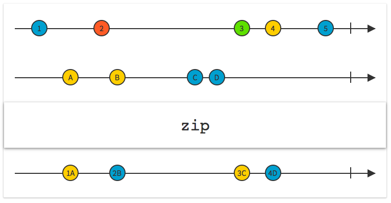

# RxJava. Паттерны реализации

## Event driven подход

Обычный императивный код можно превратить в event-driven для лучшего разделения компонентов или служб. 


__UserService__ - регистрирует новых пользователей в системе. 

__CommentService__ - позволяет отправить комментарий по теме.

__EmailService__ - отправляет емайлы. 

После регистрации пользователя ему отправляется email. 

После публикации комментария также должны быть отправлены email'ы определенным пользователям. 

__Email Monitor Service__ - подписчик субъекта UserService. 

__UserService__ и __CommentService__ не знают о __EmailService__ - между ними нет сильной связи.

Этот паттерн не подходит для реализации бизнес-логики, когда служба вызывает службу, которая возвращает результат, на основе которого выбирается то или иное следующее действие. Но если знание такого результата не нужно, то он подходит.

Пример реализации event driven подхода

```java
// main method
EmailService emailService = new EmailServiceImpl();
UserService userService = new UserServiceImpl();

new EmailMonitor(emailService, userService);

userService.addUser("someuser", "some@user.com");

Thread.sleep(2000);
```

```java
public interface EmailService {
    void sendEmail(List<String> recipientList, String fromEmail, String subject, String text);
}
// EmailServiceImpl просто выводит в консоль значения аргументов sendEmail()

public interface UserService {
    void addUser(String username, String emailAddress);
	
	void subscribeToUserEvents(Observer<UserEvent> subscriber);
	void subscribeToUserEvents(Action1<UserEvent> onNext);
}

public class UserEvent {
    private final String username;
	private final String emailAddress;
	private final Date eventDate;
    // ...
}
public class CreateUserEvent extends UserEvent {
	public CreateUserEvent(String username, String emailAddress) {
	    super(username, emailAddress);
	}
}

public class UserServiceImpl implements UserService {
    
	private final PublishSubject<UserEvent> userEventSubject;
		
	public UserServiceImpl() {
	    userEventSubject = PublishSubject.create();
	}
	
	@Override
	public void addUser(String username, String emailAddress) {
	    UserEvent addUserEvent = new CreateUserEvent(username, emailAddress);
		userEventSubject.onNext(addUserEvent); // publish the event to userEventSubject
	}
    
	// Внешние сущности благодаря этому могут подписаться на события из UserServiceImpl
	@Override 
	public void subscribeToUserEvents(Observer<UserEvent> subscriber) {
	    userEventSubject.subscribe(subscriber);
	}
}

public class EmailMonitor {
    private final EmailService emailService;
	
	public EmailMonitor(EmailService emailService, UserService userService) {
	    this.emailService = emailService;
		
		userService.subscribeToUserEvents(this::handleUserEvent);
	}
	
	private void handleUserEvent(UserEvent t) {
	    System.out.println(Thread.currentThread().getName());
		
		ArrayList<String> recipList = new ArrayList<>();
		recipList.add(t.getEmailAddress());
		String text = "Hi " + t.getUsername();
		emailService.sendEmail(recipList, "noreply@example.com", "Welcome!", text);
	}
}
```

Это пример того, как можно устранить сильную связь между двумя службами с помощью __Subject__. 

## Data Store - пример (JDBC)

Микросервисная архитектура


Микросервисы вызываются из __edge__-службы.

Как агрегировать информацию от нескольких микросервисов, используя для этого RxJava?

```java
// main method
TestDatabase.init();

// Основной класс для запуска действий с БД:
CustomerService customerService = new CustomerService();

Object waitMonitor = new Object();

synchronized (waitMonitor) {
	// Вызов главного интересующего нас метода 
	// (он использует не только customerService, но и другие службы):
    Observable<Customer> customerData = 
		customerService.fetchCustomerWithAddressesAndOwnedProducts(1);
	
	customerData.subscribeOn(Schedulers.newThread())
	    .subscribe(
		    // Show customer, addresses and products
		    customer -> System.out.println(customer.toString()), 
		    t -> t.printStackTrace(),
		    () -> {
		        synchronized (waitMonitor) { waitMonitor.notify(); }
		    }
		);
}


// CLASSES
public class TestDatabase {
	// Метод инициализации, настройки и добавления данных в БД
    public static void init() throws SQLException { ... }
	
	// Обертка JDBC-соединения в объект Rx ConnectionSubscription
	public static ConnectionSubscription createSubscription() {
	    return new ConnectionSubscription(createConnection());
	}
	
	// Создание JDBC-соединения
	public static Connection createConnection() {
	    try {
		    return DriverManager.getConnection("jdbc:derby:dbtest_5")
		} catch (SQLException ex) {
		    throw new RuntimeException(ex.getMessage, ex);
		}
	}
}

public class CustomerService {
	// Класс для реальной работы с БД:
    private final TestDatabaseProcedures procedures = new TestDatabaseProcedures();
	private final AddressService addressService = new AddressService();
	private final ProductService productService = new ProductService();
	
	public CustomerService() {}
	
	public Observable<Customer> fetchCustomer(long customerId) {
	    try {
		    return procedures.toSelectCustomersObservable(customerId);
		} catch (SQLException ex) { throw new RuntimeException(...); }
	}
	
	public Observable<Customer> fetchCustomerWithAddressesAndOwnedProducts(long customerId) {
	    Observable<Customer> selectedCustomerObservable = fetchCustomer(customerId);
		Observable<Address> selectedAddressesObservable = 
			addressService.fetchCustomerAddresses(customerId);
		Observable<OwnedProduct> selectedProductsObservable = 
			productsService.fetchOwnedProducts(customerId);

        // Combine 3 streams of events - для получения одного Customer
		Observable<CustomerRelatedData> dataStream = Observable.concat(
		    selectedCustomerObservable, selectedAddressesObservable, selectedProductsObservable
		)/*.observeOn(Schedulers.computation())*/;
		// получаем 1 большой observable для CustomerRelatedData
		
		// Обернуть dataStream в другой Observable - получим 
		// Observable<Observable<CustomerRelatedData>>, который нужен для функции zip()
        Observable<Observable<CustomerRelatedData>> wrappedDatastream = Observable.from(dataStream);
		
		// объект-аккумулятор, что можно было использовать zip(), для того, чтобы 
		// преобразовать данные в единственный объект Customer
		CustomerZipAccumulator accum = new CustomerZipAccumulator();
		
		// zip() преобразует данные в единственный объект Customer
		Observable<Customer> finalObservable = Observable.zip(
			    wrappedDatastream, 
			    accum::collapseCustomerEvents // метод, превращающий элементы потока в единый DTO
			).last(); // Берем последний элемент Customer
		// так как zip создаст 20 объектов для 20 событий, а нам нужен только 1
			
		return finalObservable;
	}
}

public class TestDatabaseProcedures {
    public Observable<Customer> toSelectCustomersObservable() throws SQLException {
		// using - управление соединением и жизненным циклом - и освобождение ресурсов в конце
		// Фабрика для создания Observable:
	    return Observable.using(TestDatabase::createSubscription, subscription -> {
		    try {
			    return SQLHelper.executeQuery(
				    subscription, 
					"SELECT ...",
				    resultSet -> new Customer(resultSet.getLong("ID"), resultSet.getString("USERNAME"))
				);
			} catch (SQLException e) { throw new RuntimeException(...); }
		});	
	}
	
    public Observable<Customer> toSelectCustomersObservable(long customerId) throws SQLException {
	    return Observable.using(TestDatabase::createSubscription, subscription -> {
		    try {
				System.out.println(Thread.currentThread().getName());
			    return SQLHelper.executeQuery(
				    subscription, 
					"SELECT ..." + customerId,
				    resultSet -> new Customer(resultSet.getLong("ID"), resultSet.getString("USERNAME"))
				);
			} catch (SQLException e) { throw new RuntimeException(...); }
		});	
	}
	
    public Observable<OwnedProduct> toSelectOwnedProductObservable(long customerId) throws SQLException {
	    return Observable.using(TestDatabase::createSubscription, subscription -> {
		    try {
				System.out.println(Thread.currentThread().getName());
			    return SQLHelper.executeQuery(
				    subscription, 
					"SELECT ..." + customerId,
				    resultSet -> new OwnedProduct(
					    resultSet.getLong("CUSTOMERID"), 
						resultSet.getString("PRODUCTID"),
						...
					)
				);
			} catch (SQLException e) { throw new RuntimeException(...); }
		});	
	}
	
    public Observable<Address> toSelectAddressObservable(long customerId) throws SQLException {
	    return Observable.using(TestDatabase::createSubscription, subscription -> {
		    try {
				System.out.println(Thread.currentThread().getName());
			    return SQLHelper.executeQuery(
				    subscription, 
					"SELECT ..." + customerId,
				    resultSet -> new Address(
					    resultSet.getLong("ID"), 
					    resultSet.getLong("CUSTOMERID"), 
						resultSet.getString("PRODUCTID"),
						resultSet.getString("ADDRESS1"),
						resultSet.getString("ADDRESS2"),
						...
					)
				);
			} catch (SQLException e) { throw new RuntimeException(...); }
		});	
	}
}

public class SQLHelper {
    public static <T> Observable<T> executeQuery(ConnectionSubscription subscription, String sqlString, 
		    RowMapper<T> rowMapper) throws SQLException {
	    ArrayList<T> workList = new ArrayList<>();
			
		Statement s = subscription.getConnection().createStatement();
		subscription.registerResourceForClose(s);
		ResultSet rs = s.executeQuery(sqlString);
		subscription.registerResourceForClose(rs);
		
		while (rs.next()) 
		    workList.add(rowMapper.call(rs));
			
		return Observable.from(workList);
	}
}

public class AddressService {
    private final TestDatabaseProcedures procedures = new TestDatabaseProcedures();
	
	public Observable<Address> fetchCustomerAddresses(long customerId) {
	    try {
		    return procedures.toSelectAddressObservable(customerId);
		} catch (SQLException ex) { throw new RuntimeException(...); }
	}
}

// DTOs:
// они безопасны при многопоточной работе
// Базовый класс для классов, которым нужен customerId
public class CustomerRelatedData {
    private long customerId;
	
	public CustomerRelatedData() {} 
	public CustomerRelatedData(long customerId) { this.customerId = customerId; } 
    public long getCustomerId() {
	    return customerId;
	}
}

public class Address extends CustomerRelatedData {
    private long id;
	private String address1, address2, city, state, postalCode;
	// 2 constructors (empty and other for fields) and getters
}

public class OwnedProduct extends CustomerRelatedData {
    private long id;
	private String name;
	// 2 constructors (empty and other for fields) and getters
}

public class Customer extends CustomerRelatedData {
    private String username;
	private final List<Address> addresses = new ArrayList<>();
	private final List<OwnedProduct> products = new ArrayList<>();
	
	// 2 constructors (empty and other for fields) and getters
	// ...
	
	public void addAddress(Address a) {
	    addresses.add(a);
	}

	public void addOwnedProduct(OwnedProduct p) {
	    products.add(p);
	}
}

public class CustomerZipAccumulator {
    private Customer customer;
	
	public void addAddress(Address a) {
	    customer.addAddress(a);
	}
	
	public void addOwnedProduct(OwnedProduct p) {
	    customer.addOwnedProduct(p);
	}
	
	public Customer getCustomer() {
	    return customer;
	}
	
	public Customer collapseCustomerEvents(Object[] events) {
	    for (Object event : events) {
		    CustomerRelatedData nextData = (CustomerRelatedData)event;
			if (nextData instanceof Customer) {
			    customer = (Customer) nextData;
			} else if (nextData instanceof Address) {
			    customer.addAddress((Address)nextData);
			} else if (nextData instanceof OwnedProduct) {
			    customer.addOwnedProduct((OwnedProduct)nextData);
			}
		}
		
		return customer;
	}
}

// RowMapper - берет единичный набор из JDBC, и ожидает, что вы преобразуете его в data transfer object.
@FunctionalInterface
public interface RowMapper<T> {
    public T call(ResultSet rs) throws SQLException;
}
```

В результате код выведет идентификатор и имя клиента, его адреса и приобретенные товары.

---

## Zip

combine the emissions of multiple Observables together via a specified function and emit single items for each combination based on the results of this function



The Zip method returns an Observable that applies a function of your choosing to the combination of items emitted, in sequence, by two (or more) other Observables, with the results of this function becoming the items emitted by the returned Observable. It applies this function in strict sequence, so the first item emitted by the new Observable will be the result of the function applied to the first item emitted by Observable #1 and the first item emitted by Observable #2; the second item emitted by the new zip-Observable will be the result of the function applied to the second item emitted by Observable #1 and the second item emitted by Observable #2; and so forth. It will only emit as many items as the number of items emitted by the source Observable that emits the fewest items.

