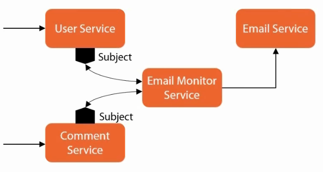
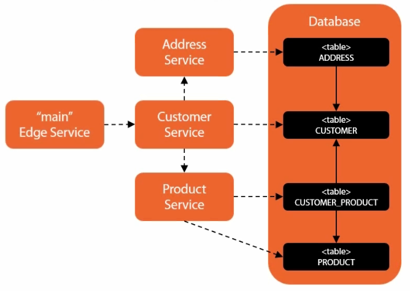

# RxJava. Паттерны реализации - Event driven

Обычный императивный код можно превратить в event-driven для лучшего разделения компонентов или служб. 



__UserService__ - регистрирует новых пользователей в системе. 

__CommentService__ - позволяет отправить комментарий по теме.

__EmailService__ - отправляет емайлы. 

После регистрации пользователя ему отправляется email. 

После публикации комментария также должны быть отправлены email'ы определенным пользователям. 

__Email Monitor Service__ - подписчик субъекта UserService. 

__UserService__ и __CommentService__ не знают о __EmailService__ - между ними нет сильной связи.

Этот паттерн не подходит для реализации бизнес-логики, когда служба вызывает службу, которая возвращает результат, на основе которого выбирается то или иное следующее действие. Но если знание такого результата не нужно, то он подходит.

## Event driven подход

Пример реализации event driven подхода

```java
// main method
EmailService emailService = new EmailServiceImpl();
UserService userService = new UserServiceImpl();

new EmailMonitor(emailService, userService);

userService.addUser("someuser", "some@user.com");

Thread.sleep(2000);
```

```java
public interface EmailService {
    void sendEmail(List<String> recipientList, String fromEmail, String subject, String text);
}
// EmailServiceImpl просто выводит в консоль значения аргументов sendEmail()

public interface UserService {
    void addUser(String username, String emailAddress);
	
	void subscribeToUserEvents(Observer<UserEvent> subscriber);
	void subscribeToUserEvents(Action1<UserEvent> onNext);
}

public class UserEvent {
    private final String username;
	private final String emailAddress;
	private final Date eventDate;
    // ...
}
public class CreateUserEvent extends UserEvent {
	public CreateUserEvent(String username, String emailAddress) {
	    super(username, emailAddress);
	}
}

public class UserServiceImpl implements UserService {
    
	private final PublishSubject<UserEvent> userEventSubject;
		
	public UserServiceImpl() {
	    userEventSubject = PublishSubject.create();
	}
	
	@Override
	public void addUser(String username, String emailAddress) {
	    UserEvent addUserEvent = new CreateUserEvent(username, emailAddress);
		userEventSubject.onNext(addUserEvent); // publish the event to userEventSubject
	}
    
	// Внешние сущности благодаря этому могут подписаться на события из UserServiceImpl
	@Override 
	public void subscribeToUserEvents(Observer<UserEvent> subscriber) {
	    userEventSubject.subscribe(subscriber);
	}
}

public class EmailMonitor {
    private final EmailService emailService;
	
	public EmailMonitor(EmailService emailService, UserService userService) {
	    this.emailService = emailService;
		
		userService.subscribeToUserEvents(this::handleUserEvent);
	}
	
	private void handleUserEvent(UserEvent t) {
	    System.out.println(Thread.currentThread().getName());
		
		ArrayList<String> recipList = new ArrayList<>();
		recipList.add(t.getEmailAddress());
		String text = "Hi " + t.getUsername();
		emailService.sendEmail(recipList, "noreply@example.com", "Welcome!", text);
	}
}
```

Это пример того, как можно устранить сильную связь между двумя службами с помощью __Subject__. 

## Data Store - пример (JDBC)

Микросервисная архитектура



Как агрегировать информацию от нескольких микросервисов, используя для этого RxJava?