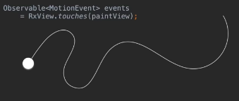
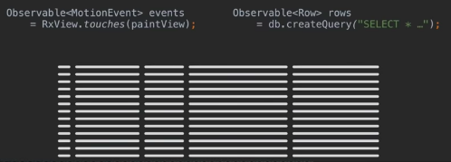

# RxJava2

## Backpressure

Backpressure позволяет вам контролировать, как быстро _источник_ излучает события. Оно позволяет замедлить частоту событий от источника, чтобы у обрабатывающей эти данные стороны было время на их обработку.

Когда поток данных проходит через асинхронные шаги, каждый шаг может выполнять различные действия с разной скоростью. Чтобы избежать проблем, связанных со слишком большим количеством таких действий (они могут привести повышенному потреблению памяти), применяется __backpressure__. Это форма контроля потока, когда шаги могут выразить, сколько элементов они готовы обработать. Это позволяет ограничить потребление памяти потоками данных в ситуациях, когда нет способа на этапе некоторого шага определить, сколько элементов может прийти из __upstream__.

Идея backpressure относится ко всем типам, но не все _источники_ реализуют её. Так что в конце концов вы получите аварийное завершение процесса из за отсутствия поддержки backpressure во время выполнения.

Backpressure (или отсутствие его поддержки) должно учитываться при дизайне системы. Поэтому в RxJava2 есть 2 типа.

Backpressure поддерживается классом __Flowable__. 

Остальные классы - __Observable__ (предназначен для коротких последовательностей событий, взаимодействия с UI и т.п.), __Single__, __Maybe__, __Completable__ - нет.

__Пусть__ у нас есть источник данных - touch event'ов. Пользователь ставит палец на экран и протягивает его. В данном случае мы не можем замедлить частоту событий или приказать пользователю прекратить двигать пальцем на половине работы. 

Это можно сравнить с работой с БД, где мы можем иметь большой набор данных в качестве результата запроса. А получить мы хотим только первые 4 из них, потом еще 4, еще 4 и т.д. БД моделирует ситуацию с backpressure через курсоры в отличие от touch event'ов.

На картинках приведен код из RxJava1. В первом случае в рантайме он может привести к `MissingBackpressureException`.

В RxJava2 мы должны использовать 2 разных типа. Возможно преобразование между этими типами, но здесь об этом не будем.
