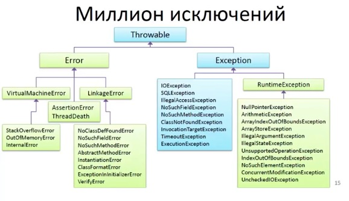

## Исключения в Java

__Вопрос__: Какие типы исключений в Java вы знаете?

* unchecked
* Errors (неправильно)
* checked



В Java 2 типа исключений. Checked - это исключения, проверяемые в момент компиляции. 

Если код в методе выбрасывает checked-исключение, то он должен либо обработать его, либо специфицировать это исключение ключевым словом `throws`.

Например, следующая программа открывает файл и распечатывает его первые три строки. Она не скомпилируется, так как `main()` использует `FileReader`, а его конструктор выбрасывает checked-исключение `FileNotFoundException`. Он также использует методы `readLine()` и `close()`, а они выбрасывают исключение `IOException`.

```java
import java.io.*;
class Main {
    public static void main(String[] args) {
        FileReader file = new FileReader("C:\\test\\a.txt");
        BufferedReader fileInput = new BufferedReader(file);         
        // Print first 3 lines of file "C:\test\a.txt"
        for (int counter = 0; counter < 3; counter++) 
            System.out.println(fileInput.readLine());
        fileInput.close();
    }
}
```

Результат:

```
Exception in thread "main" java.lang.RuntimeException: Uncompilable source code - 
unreported exception java.io.FileNotFoundException; must be caught or declared to be 
thrown
	at Main.main(Main.java:5)
```

Для исправления программы нужно либо специфицировать выбрасываемые методом `main()` исключения, либо использовать try-catch блок. `FileNotFoundException` является подклассом `IOException`, и его по правилам языка Java задавать в списке выбрасываемых исключений не обязательно:

```java
import java.io.*;
//
class Main {
    public static void main(String[] args) throws IOException {
        FileReader file = new FileReader("C:\\test\\a.txt");
        BufferedReader fileInput = new BufferedReader(file);         
        // Print first 3 lines of file "C:\test\a.txt"
        for (int counter = 0; counter < 3; counter++) {
            System.out.println(fileInput.readLine());
        }
        fileInput.close();
    }
}
```

Unchecked-исключения - не проверяются во время компиляции. Такими исключениями являются исключения, производные от `Error` и `RuntimeException`. Всё остальное, что является производным от `Throwable`, является checked-исключениями.

`Throwable` <-- `Error`

`Throwable` <-- `Exception` <-- `RuntimeException`

Следующая программа скомпилируется, хотя она выбрасывает `ArithmeticException`. Оно является unchecked.

```java 
class Main {
   public static void main(String args[]) {
      int x = 0;
      int y = 10;
      int z = y/x;
  }
}
```

`Throwable` можно перехватывать в `catch`, но это плохая практика.

`Error` - это критическая ошибка на уровне работы виртуальной машины или приложения, которую устранить практически невозможно.

---

Главное, что есть у исключения -- это __сообщение__ (message) и __причина__ (cause). Хотя того или/и другого может и не быть.

Сообщение -- это текст, а причина - это какое-то другое исключение.

--

Конструкторы `Throwable`

* `Throwable();`
* `Throwable(message);`
* `Throwable(cause);`
* `Throwable(message, cause);`
* `protected Throwable(message, cause, suppression, stackTrace);`

protected конструктор можно вызывать из субклассов, нужен редко, но полезен.

Каждое исключение в момент создания ослеживает текущее состояние _стека вызовов_ - это может быть 200 вложенных вызовов и больше, поэтому операция его получения затратна. Создается поле внутри исключения, в котором это запоминается.

Одно исключение может подавить другие исключения. Пусть какой-то процесс вызвал много исключений, и вы не хотели бы их все терять. Тогда вы создаете новое исключение добавляете те исключения через `addSuppressed()`, чтобы работать с ними потом.

`exc.printStackTrace()` выводит стек не того места, где исключение было кинуто, а где оно было создано. Хотя обычно это одно и то же место - см. `throw new SomeException(params)`.

__Что делается в блоке обработки исключения?__

* Логирование или вывод пользователю.
* Восстановление после исключения (например, вторая попытка подключения после обрыва связи).
* Исключение для управления потоком (это не очень правильный способ управления потоком).
* Перебрасывание, завернув в исключение другого типа. Всегда сохраняйте исходное исключение в виде причины.