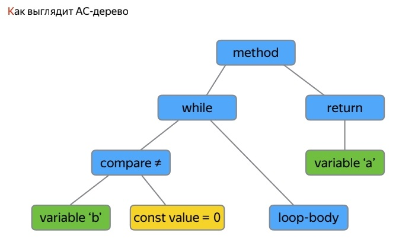

## Рефлексия в Java

Рефлексия - это механизм, который позволяет получить информацию об объектах во время выполнения программы или изменить их свойства.

При этом используются низкоуровневые JNI инструменты, чтобы добраться до сущностей Java (классов и интерфейсов) во время выполнения (runtime). 

* Можно получить доступ к Java-объекту, его полям, методам, статическим полям и методам. 
* Динамический поиск и загрузка классов, причем не требуется доступ к исходному коду - Можно даже получить доступ к классам, которых у нас нет в виде исходников - т.е. можно через загрузичики - class loaders - загружать классы и инстанцировать их во время выполнения. 

__Как использовать Reflection API?__

Как выглядит Reflection API? Не очень страшно. Пусть у нас есть простой класс `HelloWorld`:

```
public class HelloWorld {
  private String secret = “secret info”;

  public void sendSecret() {
    Network.getInstance().send(this.secret);
  }
}
```

- закрытое поле и открытый метод, отправляющий значение закрытого поля на сервер. Вопрос - как получить доступ к объекту `HelloWorld` в runtime во время работы приложения?

Для этого можно написать свой класс-"шпион":

```
class Spy {
  public void getSecret() {
    HelloWorld hw = new HelloWorld();
    Field f = hw.getClass().getField(“secret”);
    Log.v(“Reflect”, f.get(hw));
  }
}
```

получает экземпляр класса `HelloWorld` и извлекает из него поле.

Но этот метод работать не будет - вместо `getField()` нужно написать `getDeclaredField()`:

```
class Spy {
  public void getSecret() {
    HelloWorld hw = new HelloWorld();
    Field f = hw.getClass().getDeclaredField(“secret”);
    Log.v(“Reflect”, f.get(hw));
  }
}
```

В Reflection API есть 2 варианта getters - 

* `getField()`, `get*()`
* `getDeclaredField()`, `getDeclaredAnnotation()`, `getDeclared*()`

В чем разница?

* `get*()` возвращает только публичные поля и методы.
* `getDeclared*()` возвращает любые поля и методы. - можно взломать любую программу.

Нюанс - вы не получаете поступа к полям и методам суперкласса. Для этого нужно отдельно вызвать `getSuperClass()`, а у него - только `get*()` публичных членов класса. Таково, к сожалению, ограничение Reflection API.

__Что такое Proxy и как им пользоваться__

Получить объекты, обращаться к их членам - это хорошо, но что, если мы хотим скрыть реализацию? Чтобы никто не мог достучаться до объекта данного класса.

Пусть мы имеем интерфейс:

```
public interface INetworkService {
  Response getData();
  void sendData(Request data);
}
```

сетевая служба, которая получает данные с сервера и отдает их на сервер.

Для работы нужна его реализация. Но мы обойдем этот шаг - мы напишем прокси-класс и у нас не будет физической имплементации вообще. Это нужно, например, если реализация нам недоступна (я так понял), её код был обфусцирован и разобраться невозможно, из чего он состоит.

```
public static INetworkService getService() {
  ClassLoader cl = ClassLoader.getSystemClassLoader();
  Class<?>[] interfaces = new Class[] { INetworkService.class };

  return (INetworkService)Proxy.newProxyInstance(cl, interfaces, handler);
}
```

Как это работает? Благодаря class loader (в Android это DEX Class Loader). Он загружается на этапе загрузки системы (приложения). Можно создать прокси-класс сразу от нескольких интерфейсов. В прокси не обязательно реализовывать все методы этих интерфейсов. Взамен в `newProxyInstance()` передается
* class loader, 
* набор интерфейсов, которые прокси класс должен реализовать 
* и некий handler - invocation handler - структура, которая делегирует все вызовы интерфейсных методов внутрь себя. Грубо говоря, мы не обращаемся к методам как к таковым

```
private InvocationHandler handler = new InvocationHandler() {
  public @Override Object invoke(Object proxy, Method method, Object[] args) throws Throwable { 
	/*do stuff*/ 
  }
}
```

да, мы вызываем методы интерфейса, но на самом деле вызов попадает в invocation handler. В нем есть объект прокси, текущий метод - информация о том, какой метод и как мы вызываем. Из него можно подчерпнуть

```
if (method.getName())
// селектор по имени

if (method.getParameterTypes())
// по типам аргументов

if (method.getReturnType())
// проверяем возвращаемый тип
```

например, его название. Это просто строка `String`, и, как это ни грустно, можно просто сличить строки, если изначально задать названия методов как строковые константы. 

Можно переключаться по типам аргументов. Допустим, мы знаем, что в нашем интерфейсе есть 3 метода, 2 из них не принимают ни одного аргумента, третий из них принимает один аргумент. Тогда если входной аргумент есть - он не `void`, значит, вызывается третий метод. 

То же самое по возвращаемому типу - смотрим, какой тип данных возвращается этим методов, и исходя из этого селективно выбирать логику. Facebook делает это очень забавно и круто - он перегружает объект `List`. Он берет и отдает свой проксированный экземпляр `List`, и при попытке сделать `get` по id подменяет реализацию и отдает объект из своего внутреннего `Map`. Это плохой подход - если вы хотите, чтобы другие разработчики наступили на грабли -- это пример "отличного" использования Reflection - использовать прокси. 

Но при этом рефлексию в Android приходится использовать чаще, чем хотелось бы нам. Зачем?

* Нужен доступ к приватному API - приватным полям и методам любого класса. А это значит, что можно достучаться до Android SDK методов. До тех, которые помечены директивой hide - их нельзя использовать, т.к. компилятор даст ошибку. Но их можно использовать используя Reflection. Хотя такой вызов ничего не гарантирует -> Reflection выдает массу Exception, которые нужно обрабатывать. 
* Класс не доступен на этапе компиляции - их нельзя отследить и использовать в exception handling без Reflection API. - Классы Samsung из их реализации Android SDK.
* Чтобы исправить косяки вендоров 

Можно использовать Reflection API, если вы четко понимаете, чего вы хотите. Но в таком случае вместо копания в чужих кишках, гораздо проще использовать Annotation processing. 

Чем он так отличает Reflection?

[звучат названия библиотек butterknife, dagger]

Аннотации срабатывают во время компиляции <--> Рефлексия - во время выполнения и медленнее.

Поэтому все за аннотации.

Reflection - это по сути JNI вызов.

Аннотации работают по-другому, они напрямую оперируют байткодом или исходниками в целом. У нас есть препроцессор - это программа на Java, которая разбирает исходный код проекта и формирует из него т.н. AST - Abstract Syntax Tree - направленное конечное дерево, которое представляет собой граф, благодаря которому можно представить программу как набор операций над чем-то.

Abstract Syntax Tree (AST) — представление всех java-классов в виде конечного ориентированного древа. 

Имеем разбор java-программы с помощью java - ("уроборос самоотсасывания").

Как выполняется препроцессор и из чего он состоит?

* Сначала запуск препроцессора (если он есть) - прекомпиляция.
* Генерация/аугментация исходников - Затем препроцессор с помощью AST, разбирая наш исходный код по паттерну Actor-Visitor, обходит каждый Java-класс, .java-файл нашего проекта, и проходится по его звеньям (листьям) - это методы, поля и т.д. Из всего этого формируется граф. После того, как мы разобрали, мы видим, над каким методом есть аннотация, какой метод возвращает какое значение, значит мы можем сделать что-то - аугментировать код, сгенерировать какие-то исходники. 
* Дальше вся полученная каша отдается java-компилятору javac.
* Получаем на выходе массу .class-байткода - набор сгенерированных файлов. Результат всего этого в целом виден во время выполнения. Ну или кто-то может покопаться и посмотреть полученный байткод.



Каждый операнд, ключевое слово, разбиваются на 2 этапа
1. Сама команда / операция
2. Значение, которым оперирует эта команда.

Имеем цикл while, который в завимости от того, равны ли переменные a и b, вернет значение или продолжит выполнение цикла. Если этот код обложить аннотациями, то его можно аугментировать на этапе сборки проекта. 

Эта картинка может быть важна, если вам придется написать свой Android Annotation или butterknife. [Надеюсь, не придется]

Какие есть библиотеки, использующие этот механизм:

* AndroidAnnotations - хорошая, но с плохой DI-моделью. Нужна для устранения boilerplate кода типа `findViewById()`, чтобы динамически подгружать бины в наш класс. При этом бины в отличие от Dagger, напрямую связаны с контекстом. В AndroidAnnotations мы можем напрямую сказать, что "я хочу, чтобы в этом классе, который я буду подгружать в качестве бина, root context был классом MyActivity, а не просто абстрактное Activity". И только тогда, когда текущий экран будет инстансом MyActivity, этот бин к нему подгрузится. Грубо говоря, в базовом классе мы объявили десяток бинов, но подгружаться будут 3, 5, 4 класса, в зависимости от того, на каком экране мы сейчас находимся. Этим хорош AndroidAnnotations.
* ButterKnife - среднее м/у DI и AndroidAnnotations, потому что но использует многое хорошее из AndroidAnnotations, но без DI.
* Dagger 1/2 - для DI есть он. В связке с ButterKnife еще мощнее, чем AndroidAnnotations. Но генерирует много boilerplate кода, выходим за пределы DEX-лимита по полям и методам из-за него.

## Аннотации в Java

Жизненный цикл аннотации можно указать для аннотации с помощью аннотации `@Retention`. Аннотация `@Retention` позволяет указать, в какой момент жизни программного кода будет доступна аннотация: только в исходном коде, в скомпилированном классе или во время выполнения программы. Есть всего 3 вида аннотаций:

* SOURCE - аннотация доступна только в исходном коде и сбрасывается во время создания .class файла; инфу об аннотации очистят уже в байткоде, при компиляции
* CLASS - аннотация хранится в .class файле, но недоступна во время выполнения программы; инфа доступна в байткоде, но удаляется при сборке jar/dex;
* RUNTIME - аннотация хранится в .class файле и доступна во время выполнения программы. как уже догадались, аннотация типа RUNTIME сохраняется всегда и везде, а главное — в процессе работы.

Все эти типы аннотации являются элементами перечисления `java.lang.annotation.RetentionPolicy`.

Так, в примере указано, что аннотация будет доступна во время выполнения программы:

```
package com.seostella.annotation.def;

import java.lang.annotation.Retention;
import java.lang.annotation.RetentionPolicy;
import java.lang.annotation.Target;
import java.lang.annotation.ElementType;

@Target(ElementType.TYPE)
@Retention(RetentionPolicy.RUNTIME)
public interface Mammal {
	String sound();

	int color();
}
```

Немного пояснения к приведенным типам: SOURCE - этим типом стоит пользоваться если Вы хотите расширить исходный код, описанный аннотацией; CLASS - используйте этот тип если хотите добавить какие-то характеристики к классам (например, создать список классов, которые используют аннотацию) до выполнения программы; RUNTIME - является наиболее используемым типом, так как видна во время выполнения кода и, соответственно, можно воспользоваться возможностями рефлексии.

поскольку аннотация, изначально, просто специфический класс, объявленная так:

```
public @interface Override {}
```

жизненный цикл задаётся другой аннотацией)))

```
@Retention(RetentionPolicy.SOURCE) //RUNTIME || CLASS
```

и есть вторая аннотация, которую вы встретите абсолютно в каждой декларации аннотаций, без которой в них вообще нет смысла)

```
@Target(ElementType)
```

`Target` говорит, где именно можно применять нашу аннотацию) он может быть:
* TYPE, — с этим таргетом можно повесить аннотацию при объявлении класса
* FIELD, — на поля класса, статику и инстанс включительно)
* METHOD, — на любые методы
* PARAMETER, — на аргументы в сигнатуре методов и конструкторов
* CONSTRUCTOR, — на сам конструктор, не путать с методами!
* LOCAL_VARIABLE, — на локальные переменные внутри тела метода/конструктора
* ANNOTATION_TYPE, — на другие аннотации
* PACKAGE — на пакет) дадада, с 8й джавы можно навесить аннотацию прям вот так:

```
@MyTestAnnotation package ru.yamblz.example;
```

если `Retention` (жизненный цикл) - его можно указать только один; 

то `Target` — сколько угодно) хоть на всё подряд.

обидно, что нельзя аннотацию на выражение повесить, приходится `SuppressWarnings` делать либо над методом, либо через комментарий

вся эта инфа нужна двум “сущностям”) самому компилятору и Reflection API, чтобы потом в рантайме дёрнуть у класса список методов и отфильтровать его по наличии ключевой для нас аннотации. Пометили в классе 2 метода нашей `MyAnnotation`, отфильтровали и получили ссылки на нужные нам два метода) а дальше, если метод статический — можно инвокать его прям напрямую) а если нет, то нужно передать ссылку на объект

либо юзать котлин . а лучше без `SuppressWarnings` вообще, так как предупреждения выдаются компилятором не просто так.

_А для всех аннотаций генерируется код (и этим как раз занимается препроцессор)? И если пишешь свою библиотеку с аннотациями, нужно написать свой?_

аннотации – это просто метаданные, которые используются препроцессорами и рефлексией. все ок)

Просто если хочешь по этим метаданным что-то сгенерировать - пиши препроцессор

собственно, как работать с аннотациями

```
   @Target(ElementType.CONSTRUCTOR)
   @Retention(RetentionPolicy.RUNTIME)
   public @interface DefaultConstructor {
       boolean value() default true;
   }
   class HelloWorld {
       @DefaultConstructor HelloWorld() {}
      
       @DefaultConstructor(false) HelloWorld(String param) {}
   }
  
   static class Parser {
      
       static void parse(Class<? super HelloWorld> clazz) {
           Constructor<?>[] constructors = clazz.getDeclaredConstructors();
           for (Constructor<?> constructor : constructors) {
               DefaultConstructor anno = constructor.getAnnotation(DefaultConstructor.class);
               if (anno != null) {
                   boolean isDefault = anno.value();
                   if (isDefault) {
                       constructor.newInstance();
                   }
               }
           }
       }
   }
```

есть аннотация на конструктор, маркер с булевым флагом - у этого флага есть дефолтное значение 
в парсере (рантайм-сущность) ищем дефолтный конструктор и вызываем его

препроцессор делает всё то же самое, только не может инвокать/создавать что-то) поэтому, ими генерируют код, который будет это делать в рантайме) а поскольку можно сгенерировать код, вставлять в него рефлексию — глупо). и генерируются быстрые/эффективные решения, который потом являются дополнительной прослойкой сверху/снизу/сбоку
