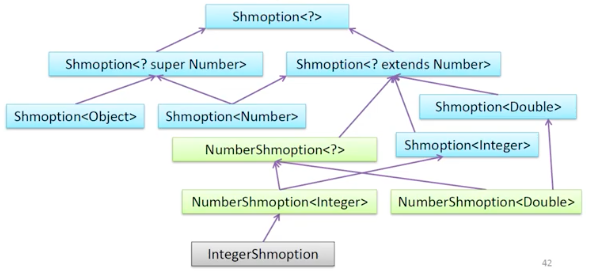

## Generics и wildcards

### Обобщённое программирование, типизация по маске и контракты

В С++ это специальная конструкция, генерирующая для каждого template кучу классов на этапе компиляции.

В Java - не так. По сути это способ работы с `Object`'ами.

Как выглядит обобщение

```java
public class MyItem {
    private Object object;
}
```

Просто класс с полем `Object`. В него можно запихнуть что угодно, а потом постоянно делать `instanceof`.

Но лучше типизировать его изначально на этапе компиляции:

```java
public class MyItem<T> {
    private T object;
}
```

`T` заменяет все типы, но при инстанцировании класса мы четко знаем, каким значением мы оперируем: `String` и т.д.

Если мы хотим хранить только `Integer` (или любые другие типы чисел), а не строки:

```java
public class MyItem<T extends Number> {
    private T object;
}
```

Узкое множество - можно ограничить не только базовым типом, но и интерфейсом (и даже несколькими интерфейсами). Не всем известна эта сигнатура, но она полезна:

```java
class Data<T extends Item & Mutable & Cloneable> {}

class Data<T extends Item & RandomAccess> {}

class Data<T extends Item, E extends List<?>> {
    private E simpleImmutableList;
}
```

А что такое `E extends List<?>`? Это тип `E` переменной, которая является списком, в который мы не сможем ничего добавить (изменить).

_Пример_: обобщённая типизация методов

```java
class MyListTransformer {
    static <T extends List<Number>> void transform(T list) {
        list.add(123);
        list.add(12.345f);
    }
}
```

Что будет, если добавить int или float? Ни одна строка не будет работать, кроме первой:

```java
public static void main(String[] argv) {
    List<Number> list1 = new ArrayList<>(); // Ok
    List<Integer> list2 = new ArrayList<>(); // Not ok
    List<Float> list3 = new ArrayList<>(); // Not ok

    MyListTransformer.transform(list1); // ok
    MyListTransformer.transform(list2); // Not ok
    MyListTransformer.transform(list3); // Not ok
}
```

Мы можем только считывать, но не записывать (кроме `Number`, где можно и считывать, и записывать)

```java
public static void main(String[] argv) {
    ArrayList<Number> list = new ArrayList<>();

    MyListTransformer.transform(list); // Ok
}
```

Потому что есть т.н. контракт PECS. Контракт wildcard’ов - _Producer extends, Consumer super!_

Пользы от `T extends List<Number>` не очень много, т.к. мы не можем использовать наследников. Для возможности этого нужно использовать wildcards или маски типов. Здесь знак `?` позволяет использовать любой тип, который наследует `Number`.

```java
List<? extends Number> producer;
producer.add(new AtomicInteger(1)); // FAIL
producer.add(123); // FAIL
producer.add(123456L); // FAIL
producer.add(12.345f); // FAIL
// no add method will ever work
```

Класс, который делает `? extends`, является __продюсером__ - мы можем считать из него данные (через get), но добавить ничего нельзя. Это косяк Java.

```java
List<? super Number> consumer;
AtomicInteger ai = consumer.get(0); // FAIL
int i = consumer.get(1); // FAIL
long l = consumer.get(2); // FAIL
float f = consumer.get(3); // FAIL
// all getters will return Object
```

Generics и wildcard’ы не гарантируют иммутабельность! PECS не гарантирует иммутабельность. Может показаться, что __Producer__ - иммутабельный объект, в который нельзя добавить ничего лишнего. На самом деле это не так. То есть нельзя ничего добавить, но можно присвоить и т.д.:

```java
List<? extends Item> list = new ArrayList<>();
list.clear(); // list not immutable :(

List strings = list;
strings.add(0, “Some simple string”);

list.get(0); // crash with ClassCastException :(
```

Контракт wildcard’ов

Зачем нужны маски типов?

Type safety

Все маски типов и генерики теряются на этапе компиляции, в итоге будет просто `Object`. Но это не теряется на уровне информации о классе. Если вызвать `getObject()`, `getClass()`, `getParametrizedType()`, то тип будет именно обобщенный.

```java
<T> void copyList(List<? extends T> src, List<? super T> dest) {
    Iterator<? extends T> srcIt = src.iterator();
    Iterator<? super T> destIt = dest.iterator();

    while (srcIt.hasNext()) {
        destIt.next();
        destIt.set(srcIt.next());
    }
}
```

Генерики нужны, т.к. они позволяют описать свой API.

`src` - producer, `dest` - consumer. Внутри нельзя записать в `src`, считать из `dest`. Этот контракт гарантирует, что нельзя скопировать список `integer` в список `number` (хотя наоборот сделать можно).

---

# Генерики (лекция Т. Валеева)

Почему нужно знать нюансы генериков? Потому что вам может встретиться код, похожий на такой:

```java
public static <T, K, U, M extends Map<K, U>> Collector<T, ?, M> toMap(
    Function<? super T, ? extends K> keyMapper, 
	Function<? super T, ? extends U> valueMapper, 
	BinaryOperator<U> mergeFunction, 
	Supplier<M> mapFactory
) {
    // ...
}
```

И вы должны понимать его смысл. Либо, что тоже возможно, вам придется писать подобный код самим. Этот код нужен, чтобы не плодить большое число перегрузок с конкретными параметрами и не дублировать один и тот же код. Обобщенное программирование должно быть задействовано.

## Параметризация типов

`class NumberList<T extends Number>`

T - __параметр типа__. В данном случае Т - это только тип, который расширяет `Number`.

`class X<T extends Y & Z>`
	
Y - тип класса, Z - тип интерфейса. В такой сигнатуре класс должен быть только один, остальные - это интерфейсы. Это по природе языка Java, в котором нет множественного наследования классов.

Параметр типа может использоваться внутри нестатических членов класса. И, например, __*подставляться параметром другого типа*__, т. е.

```java
class SomeClass<T> {
    public void someMethod() {
	    List<T> someVar = ... 
		// ...
	}
}
```

Для использования параметризованного типа необходимо подставить все параметры (с помощью явных __непримитивныx типов__, других параметров типов либо __маски__ - __*что такое маска и что она означает?*__)

```java
List<String> list = ...;
```

Обобщенный параметр класса не может использоваться в статической части класса - потому что класс генерерируется один, а использоваться может для разных типов. Поэтому непонятно, к какому конкретно типу он будет относиться.

## Пример генерик-класса

```java
/** A mutable box which is either empty or contains a non-null value */
class Shmoption<T> {
    private T value;
	
    /** Passing null means absent value */
    public Shmoption(T value) { this.value = value; }
    
	/** Never returns null */
    public T get() {
        if(value == null) throw new NoSuchElementException();
        return value;
    }
    
	public void set(T newValue) { value = newValue; }
    
	public T orElse(T other) { return value == null ? other : value; }
    
	public boolean isPresent() { return value != null; }
}
```

Использование этого генерика:

```java
Shmoption<String> present = new Shmoption<>("yes"); // ромб работает с Java 7
Shmoption<String> absent = new Shmoption<>(null);
System.out.println(present.isPresent()); // true
System.out.println(present.get()); // "yes"
System.out.println(absent.isPresent()); // false
System.out.println(absent.orElse("no")); // "no"
```

Оператор "ромб" может вывести тип из контекста.

## Маскировочный символ (wildcard)

`?` = `? extends Object` (это одно и то же выражение по смыслу).

Вопросик "?" означает, что значение этого параметра может быть любое. Это говорит о том, что нам не важно конкретное значение типа, параметризующего `Shmoption` в данном случае.

```java
Shmoption<?> present = new Shmoption<>("yes"); // Use-site variance
System.out.println(present.isPresent());  // true
System.out.println(present.get());        // yes
```

В данном случае эти методы работают правильно даже в том случае, когда нам не важно конкретное значение типа.

Use-site variance (вариативность в точке использования) 

В данном случае `present.get()` вернет `Object`:

```java
Shmoption<?> present = new Shmoption<>("yes");

System.out.println(present.isPresent());

Object value = present.get();
System.out.println(value);

present.set(???);
```

Можно ли вызвать `present.set("no")`? 

Нет. Потому что `Shmoption<?>` - это класс, у которого тип Т - неизвестен. Но при этом на деле он является каким-то конкретным, например, `Integer`'ом. Поэтому мы не можем передать тип `String` в `set()`.

Единственный легитимный для компилятора вызов метода `set()`:

```java
present.set(null);
```

А что, если вместо "?" поставить `Object`?

```java
Shmoption<Object> present = new Shmoption<>("yes");
System.out.println(present.isPresent());
Object value = present.get();
System.out.println(value);
present.set(123);
```

В этом случае код компилируется и работает. Казалось бы, зачем вообще тогда нужен дурацкий "?"?

Мы можем написать такую штуку:

```java
Shmoption<? extends Number> number = new Shmoption<>(123);
Number n = number.get();
number.set(124); // FAIL
```

Добавим еще пару классов

```java
class NumberShmoption<N extends Number> extends Shmoption<N> {
    public NumberShmoption(N value) { super(value); }
}

class IntegerShmoption extends NumberShmoption<Integer> {
    public IntegerShmoption(Integer value) { super(value); }
}
```

```java
NumberShmoption<?> number = new NumberShmoption<>(123);
Number n = number.get();
number.set(124); // FAIL

IntegerShmoption integer = new IntegerShmoption(123);
Integer i = integer.get();
integer.set(124); // OK

number = integer; // OK
```

`NumberShmoption`  нам ничего не улучшил, мы не можем вызвать сет.

`IntegerShmoption` работает.

Присваивание работает, потому что `NumberShmoption<?>` "базовый" для `NumberShmoption<Integer>`.
	
`NumberShmoption<Integer>` - это более конкретная версия `NumberShmoption<?>`.
	
На этой основе возникает осмысленность выражений с "?" 

### Надтипы и подтипы

Есть спецификация (Java?)

* У типов в Java определён частичный порядок “A > B” (А больше В) -- это значит, что A – надтип B или B – подтип A (“A :> B”, если допустимо A = B)
* “A :> B” – рефлексивно, антисимметрично, транзитивно (рефлексивно-транзитивное замыкание над предикатом “A >_1 B” – прямой надтип).
* “A > B” – антирефлексивно, антисимметрично, транзитивно.
* Надтип не должен предоставлять больше возможностей, чем предоставляет подтип.

Следствие: если S является надтипом для Т, то это не значит, что  `X<S>` является надтипом для `X<T>`.
	


Заметим, что `Shmoption<Object>`, `Shmoption<Number>`, `Shmoption<Double>` ни в каких отношениях не состоят.
	
Единственный надтип для всех - это `Shmoption<?>`.
	
`? super Number` - это неизвестный надтип типа Number.


### Чтение (producer – extends)

```java
// взять число из Shmoption и превратить его в double
static double getDoubleValue(Shmoption<Number> shmopt) {
    return shmopt.get().doubleValue();
}

getDoubleValue(new IntegerShmoption(123)); // compile error
```

Ошибка, потому что метод не принимает шмопшен от Integer - только от Number. Не можем, потому что метод с такой сигнатурой может попытаться записать в shmopt другой Number. А в передаваемый IntegerShmoption double  никак не запишешь. Поэтому это считается ошибкой компиляции.

Расширить набор типов, с которыми может работать метод, можно отказавшись от части возможностей. Например, здесь нам нужно только взять, достать значение (__producer__).

```java
static double getDoubleValue(Shmoption<? extends Number> shmopt) {
    return shmopt.get().doubleValue();
}

getDoubleValue(new IntegerShmoption(123)); // CORRECT
```

Здесь Shmoption может работать с любым Number. Записать можно только null.

### Запись (consumer – super)

```java
static void setInteger(Shmoption<Integer> shmopt) {
    shmopt.set(42);
}

NumberShmoption<Number> n = new NumberShmoption<>(123.45);
setInteger(n); // CTE
```

```java
static void setInteger(Shmoption<? super Integer> shmopt) {
    shmopt.set(42);
}

NumberShmoption<Number> n = new NumberShmoption<>(123.45);
setInteger(n);
```

Здесь нас устроит любой переданный супертип от Integer.

extends - ковариантность

super - контравариантность

без этого - инвариантность.

## Type erasure (Стирание типов)

