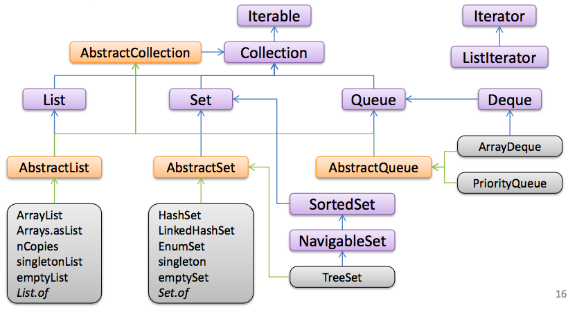

## Коллекции в Java

Родительский интерфейс для интерфейса Collection?
* Интерфейс List
* Интерфейс BeanContext
* Интерфейс Iterable [правильно]
* Никакой, не наследуется от какого либо родительского интерфейса



### Интерфейс Iterable<E>
	
Основной способ использования `Iterable<E>` - вызов метода `iterator()`:
	
```java
void printAll(Iterable<?> iterable) {
  Iterator<?> iterator = iterable.iterator();
  while (iterator.hasNext()) {
    Object obj = iterator.next();
    System.out.println(obj);
  }
}
```

`Iterator` имеет 2 полезных метода -  

* `boolean hasNext()` 
* `next()`, возвращающий следующее значение и переходящий далее по коллекции.

Код выше эквивалентен for-циклу

```java
void printAll(Iterable<?> iterable) {
  for (Object obj : iterable) {
    System.out.println(obj);
  }
}
```

В нем итератора нет, но на самом деле он есть.

Итератор может использоваться для удаления элемента, для этого есть метод `remove()` - он может удалить последний полученный через `next()` элемент, а если `next()` ни разу не вызывался, то выбрасывается исключение `UnsupportedOperationException`:

```java
iterator.remove();
```

Если вызвать `iterable.iterator()` повторно, то можно обойти коллекцию заново (обычно реализовают так, но бывают исключения из правила, которые специально документируют этот момент).

`Iterable` может быть неизменяемым, `Iterator` – нет.

С Java 8 у `iterator.remove()` есть дефолтная реализация.

### Интерфейс Collection

* `int size();` - размер; может вернуть значение не более 2 млрд элементов (но это не значит, что вы не можете поместить в коллекцию больше)
* `boolean isEmpty();` - пустая ли коллекция
* `boolean contains(Object o);` - есть ли объект в коллекции (Заметьте, что принимает `Object`, а не обобщенный тип!)
* `Object[] toArray();`
* `<T> T[] toArray(T[] a);`
* `boolean add(E e);`
* `boolean remove(Object o);`
* `boolean containsAll(Collection<?> c);`
* `boolean addAll(Collection<? extends E> c);`
* `boolean removeAll(Collection<?> c);`
* `boolean retainAll(Collection<?> c);`
* `void clear();`

