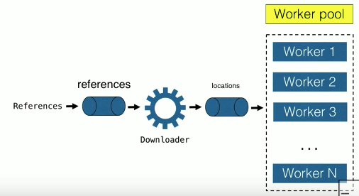

# Kotlin

## Корутины на практике

__Корутина__ - это как "легковесный поток". Так их можно воспринимать для начального понимания.


```kotlin
suspend fun main() {
    val jobs = List(100_000) {
	    GlobalScope.launch { // создать корутину так же легко как поток
		    delay(5000)
			print(".")
		}
	}
	jobs.forEach { it.join() }
}
```

### Практическая проблема

Есть функция, загружающая контент по заданному `location`

```kotlin
suspend fun downloadContent(location: Location): Content
```

Вместо данной функции можно представить аналогичную функцию, которая может выполнять одну из массы других подобных задач. Т.е. мы здесь не рассматриваем только "загрузку контента и всё". 

Модификатор `suspend` означает, что это функция является асинхронной и не блокирует вызывающего её, а просто ожидает ответа без блокировки.

Наша проблема в следующем - мы имеем много ссылок на ресурсы. И нам нужно задать процесс, который берет эти ссылки, __проходит циклически__ (1) по ним, __определяет их расположение__ (см. `location`) (2), затем __загружает контент__ по заданным расположениям (3), и потом __обрабатывает этот контент__ (4).

```kotlin
suspend fun processReferences(refs: List<Reference>) {
    for (ref in refs) { // (1)
	    val location = ref.resolveLocation() // (2)
		val content = downloadContent(location) // (3)
		processContent(ref, content) // (4)
	}
}
```

Этот код в действительности является последовательным. Он будет загружать контент по очереди, один после другого. Это не очень быстро и эффективно.

Как сделать этот код параллельным с использованием корутин?

```kotlin
fun processReferences(refs: List<Reference>) {
    for (ref in refs) { 
	    val location = ref.resolveLocation() 
		GlobalScope.launch {
    		val content = downloadContent(location)
	    	processContent(ref, content)		
		} 
	}
}
```

Какие проблемы есть у этого кода? Что может пойти не так?

```
[ref1] -> [location1] -> [launch download]
[ref2] -> [location2] -> [launch download]
[ref3] -> [Crash!]
```

Что, если ресолвинг третьей ссылки на ресурс приведёт к исключению? Функция processReferences() прервется. Но первые две итерации продолжат работать и __"утекут"__. 

Если мы попробуем перехватить исключение и запустить процесс заново, то ошибка может повториться и будет ещё больше утечек. Это истощает ресурсы приложения - мы этого не хотим.

### Структурированный параллелизм (structured concurrency)

Это ответ на данную проблему. Вместо работы с корутинами тем же образом, которым мы работали с потоками, то есть просто параллельными запусками, мы можем действовать структурированно. Что это значит?

Это значит, что вместо написания функции

```kotlin
fun processReferences(refs: List<Reference>)
```

мы снова напишем suspend-функцию

```kotlin
suspend fun processReferences(refs: List<Reference>)
```

но мы не хотим, чтобы она завершалась только тогда, когда всё уже выполнено. Мы хотим работать структурированным образом. Чтобы функция завершала работу только тогда, когда всё выполнено, но была неблокирующей.

Поэтому мы будем использовать функцию `coroutineScope()`, которая определяет границы параллельной работы на составляющие, которые должны дожидаться результата:

```kotlin
suspend fun processReferences(refs: List<Reference>) = 
	coroutineScope {
        for (ref in refs) { 
	        val location = ref.resolveLocation() // (*)
		    launch {
    	    	val content = downloadContent(location)
	        	processContent(ref, content)		
		    } 
	    }
	}
```

и внутри - просто `launch()` вместо `GlobalScope.launch()`. 

И эта конструкция делает магию для нас. launch становится ребенком для coroutineScope. Он привязан к этому coroutineScope, вместо того, чтобы работать независимо через GlobalScope. И это совсем не то же, что работа с потоками - для потоков у нас нет подобной концепции. 

Как это нам помогает? Теперь если в коде (*) произойдет исключение, то оно пройдёт через coroutineScope, и этот coroutineScope __отменит__ выполнение корутин в launch. __Утечек не будет__.

coroutineScope waits for completion - она будет ожидать завершения кода в своем теле. И вся необходимая очистка в любом случае отработает. В случае ошибки её можно безопасно попробовать вызвать повторно. _Состояние будет чистым._

### Состояние (state)

Мы имеем некоторый процесс(ы), обладающием состоянием. Например, пусть у нас есть процесс загрузки:

```
References -> [Download process] -> Contents
```

Пусть несколько ссылок 

```
ref1 -> location_x
ref2 -> location_y
```

задают ресурс от одного и того же места, и мы не хотим загружать его дважды.

Download process имеет некоторое состояние. Если мы работаем через потоки, то мы хотим инкапсулировать это состояние - отслеживать, из каких мест мы осуществляем загрузку. То есть это больше не простая функция, а процесс с состоянием.

В ООП с потоками это будет класс

```kotlin
class Downloader {
    private val requested = mutableSetOf<Location>() // State - множество мест загрузки
    
	fun downloadReference(ref: Reference) {
	    val location = ref.resolveLocation()
		
		if (requested.add(location)) { // если локация встретилась впервые
		    // schedule download
		}
		// ... wait for result
		processContent(ref, content)
	}
}
```

В некотором смысле корутины аналогичны тредам - они тоже включают конкурентность: если мы имеем несколько корутин, то это аналогично тому, что иметь несколько потоков - будут происходит конкурентные процессы. 

В реальном приложении может быть несколько корутин, которые вызовут метод `downloadReference()` конкурентным образом - внутри него будет конкурентное обращение к `requested.add()`. Это __shared mutable state__ между несколькими корутинами.

Shared + Mutable = Danger!

Сложно отслеживать ошибки с блокировками и т.п. В данном случае нет разницы между тредами и корутинами. 

Но корутины хороши тем, что, в отличие от тредов, они позволяют отказаться от такого стиля программирования. 

* Вместо shared mutable state - разделение информации через коммуникацию между корутинами. 
* Вместо примитивов синхронизации - __примитивы коммуникации__. 
* Вместо классов - корутины для инкапсуляции состояния.

Как это сделать? Вместо инкапсуляции класса делаем launch корутины

```kotlin
launch {
    val requested = mutableSetOf<Location>()
    
	for (ref in references) {
	    val location = ref.resolveLocation()		
		if (requested.add(location)) { // добавление идет в собственный Set корутины, а не общий
		    // schedule download
		}
		// ... wait for result
		processContent(ref, content)
	}
}
```

Изменяемое состояние не является общим.

Но есть проблема - откуда взять список ссылок `references` для работы с ними. Для этого используем примитив коммуникации __Channel__. Этот примитив позволяет передать информацию из внешнего мира в нашу корутину, при этом не опасаясь, что это будет shared mutable state. 

Давайте посмотрим, как он используется

```kotlin
fun CoroutineScope.downloader(
    references: ReceiveChannel<Reference>
) = launch {
	    ...
    }
```

Для работы с Channel надо получить ссылку на него откуда-то. Для этого мы объявляем функцию `downloader()`. Эта функция принимает Channel в качестве параметра. Эта корутина собирается __принимать__ данные из канала (receive channel).

СОГЛАШЕНИЕ: когда мы имеем функцию, запускающующуюся внутри корутины, мы определяем расширение для `CoroutineScope`. Это соглашение делает код самодокументирующимся и означает, что мы видим в коде функцию, которая лончится в синхронном процессе. 

`launch()` также определена как расширение в `CoroutineScope`, по
тому можно ее запустить из любого внешнего scope.

```kotlin
fun CoroutineScope.downloader(
    references: ReceiveChannel<Reference>,
) = launch {
	    val requested = mutableSetOf<Location>()  
		for (ref in references) {
		    val location = ref.resolveLocation()		
			if (requested.add(location)) { // добавление идет в собственный Set корутины, а не общий
			    // schedule download (*)
			}
			// ... wait for result
			processContent(ref, content)
		}
    }
```

Загрузку мы хотим сделать параллельной, поэтому мы не можем ее сделать прямо в (*). Для этого тоже используем корутины

```kotlin
if (requested.add(location)) {
	launch { ... }
}
```

Но здесь опять могут быть проблемы. В чем они? Утечки закрыты, так как это дочерняя корутина. Проблема в другом. Сами корутины дешевы, но выполняемый внутри в них код может быть очень долгим и ресурсоемким. Мы не можем позволить себе иметь сотни тысяч соединений одновременно. Поэтому степень параллельности нужно ограничивать.

### Ограничение конкурентности (Limiting concurrency)

Как ее ограничить? С помощью паттерна __Worker pool__. Вместо запуска теоретически бесконечного количества корутин, которые будут осуществлять загрузку, мы ограничим их число определенным значением, которое мы можем контролировать. Это число может быть параметром конфигурации, задающим степень конкурентности.



Создадим эти корутины, выполняющие работу по загрузке; и теперь, когда `references` приходят в `Downloader` через Channel, мы будем использовать другой Channel чтобы отправить сведения о локации, с которой нужно осуществить загрузку, в __Worker pool__. Теперь корутина `downloader()`, которая имела 1 параметр, будет иметь 2:

```kotlin
fun CoroutineScope.downloader(
    references: ReceiveChannel<Reference>,
	locations: SendChannel<Location>
) 
```

locations - это send channel в противоположность references. 
