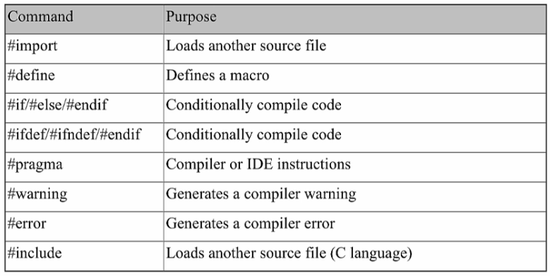

# Objective-C. Базовый синтаксис

## Hello, World

```objectivec
#import <Foundation/Foundation.h> // импортирует Foundation Framework

int main(int argc, const char * argv[]) {
  
    @autoreleasepool {
		NSLog(@"Hello, World!"); // функция записывает строку в консоль
	}
	
	return 0;
}
```

Результат выполнения:

```
Hello, World!
```

__Basic statement__ - заканчивается точкой с запятой.

__Compound statement__ - в фигурных скобках, задающих __*scope*__. autoreleasepool statement - это сompound statement с заданным скобками scope. И main блок - тоже.

---

## Базовые типы Objective-C

__Скалярные типы Objective-C__:


`NSInteger` рекомендуется использовать вместо `long`.

__Модификаторы переменных Objective-C__:


`auto` - автоматическая переменная - обычная локальная или глобальная переменная.

`register` нужен для перформанса; например, можно использовать в некоторых циклах.


Эти модификаторы относятся к управлению памятью. 

`sizeof(x)` - функция для определения размера переменной в памяти (количество байт).

`sizeof(NSInteger)` (8 для 64б архитектуры) - ее можно также вызвать для типа.

## Структуры

Это пример типа, для которого можно определить свое имя.

```objectivec
struct MyPoint {
    float x;
	float y;
};

// main
struct MyPoint point;

point.x = 1.1;
point.y = 2.3;
```

Еще пример структуры

```objectivec
struct MyLine {
    struct MyPoint startPoint;
    struct MyPoint endPoint;
};
```

Ключевое слово `typedef` позволяет определить имя, для которого не нужно везде писать `struct`. 

```objectivec
typedef struct {
    float x;
	float y;
} MyPoint;

// main
MyPoint point;

point.x = 1.1;
point.y = 2.3;
```

## Перечисления

Способ 1

```objectivec
enum {
   first = 10,
   second = 100,
   third = 1000
};

typedef NSUInteger MyEnum;

// main
MyEnum x;
```


Способ 2 (>= iOS 6)

```objectivec
typedef enum MyEnum : NSUInteger {
   first = 10,
   second = 100,
   third = 1000
} MyEnum;
```

или

```objectivec
typedef NS_ENUM(NSUInteger, MyEnum)
   first = 10,
   second = 100,
   third = 1000
};
```

## Указатели Objective-C

Одна из самых сложных вещей =)

Указатель - это переменная, содержащая __адрес__ другой переменной.

```objectivec
int y = 7;
int *z = &y; // * - оператор указателя, & - оператор взятия адреса

int p = *z; // * - оператор разыменования
*z = 5;
```

### Преобразование типов

```objectivec
float a = 1.23;
int b = (int) a;
```

## Функции в Objective-C

```objectivec
int factorial(int number) {
    int res = 1;
	
	for(int i = 1; i <= number; ++i) {
	    result = result * i;
	}
	
	return result;
}
```

По умолчанию все передается по значению.

`.m` - обычное расширение для файлов кода на objective-c.

Для выделения функции в отдельный файл нужно определить хедер-файл и m-файл.

```objectivec
// FactorialModule.h

#ifndef Factorial_FactorialModule_h
#define Factorial_FactorialModule_h

extern int int factorial(int number);

#endif
```

потом он импортируется через директиву препроцессора `#import`.

Для локального кода проекта

```objectivec
#import "HeaderFile.h"
```

Для системных фреймворков или сторонних библиотек

```objectivec
#import <HeaderFile.h>
```

Функии Objective-C - такие же как в С. Читайте книги по С, что там сказано про функции.


## Управление потоком программы

### "Fast enumeration"

Это способ обойти коллекцию объектов без манипуляций с переменной индекса.

__Цикл for__

Обычный обход массива строк:

```objectivec
NSArray *array = @[@"First", @"Second", @"Third"];

for (NSInteger n = 0; n < [array count]; n++) {
    NSLog(@"Showing item: %@", array[n]);
}
```

Fast enumeration:

```objectivec
NSArray *array = @[@"First", @"Second", @"Third"];

for (NSString *str in array) {
    NSLog(@"Showing item: %@", str);
}
```


## Использование препроцессора

```objectivec
#define ITERATIONS 10
```

команда препроцессора, которая на этапе работы препроцессора подставит 10 вместо ITERATIONS.



Через проверку значений от препроцессора (из Cocoa Framework) можно проверить во время компиляции, что это программа для iPhone или iPad и многое другое.

