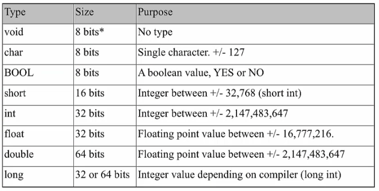
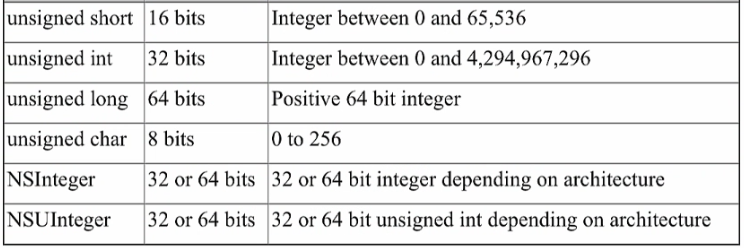
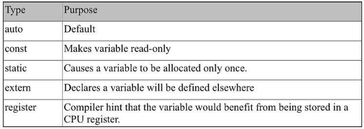
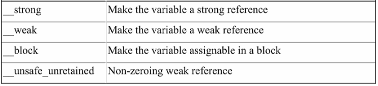

# Objective-C. Базовый синтаксис

## Hello, World

```objectivec
#import <Foundation/Foundation.h> // импортирует Foundation Framework

int main(int argc, const char * argv[]) {
  
    @autoreleasepool {
		NSLog(@"Hello, World!"); // функция записывает строку в консоль
	}
	
	return 0;
}
```

Результат выполнения:

```
Hello, World!
```

__Basic statement__ - заканчивается точкой с запятой.

__Compound statement__ - в фигурных скобках, задающих __*scope*__. autoreleasepool statement - это сompound statement с заданным скобками scope. И main блок - тоже.

---

## Базовые типы Objective-C

__Скалярные типы Objective-C__:





`NSInteger` рекомендуется использовать вместо `long`.

__Модификаторы переменных Objective-C__:



`auto` - автоматическая переменная - обычная локальная или глобальная переменная.

`register` нужен для перформанса; например, можно использовать в некоторых циклах.



Эти модификаторы относятся к управлению памятью. 

`sizeof(x)` - функция для определения размера переменной в памяти (количество байт).

`sizeof(NSInteger)` (8 для 64б архитектуры) - ее можно также вызвать для типа.

## Структуры

Это пример типа, для которого можно определить свое имя.

```objectivec
struct MyPoint {
    float x;
	float y;
};

// main
struct MyPoint point;

point.x = 1.1;
point.y = 2.3;
```

Еще пример структуры

```objectivec
struct MyLine {
    struct MyPoint startPoint;
    struct MyPoint endPoint;
};
```

Ключевое слово `typedef` позволяет определить имя, для которого не нужно везде писать `struct`. 

```objectivec
typedef struct {
    float x;
	float y;
} MyPoint;

// main
MyPoint point;

point.x = 1.1;
point.y = 2.3;
```

## Перечисления

Способ 1

```objectivec
enum {
   first = 10,
   second = 100,
   third = 1000
};

typedef NSUInteger MyEnum;

// main
MyEnum x;
```


Способ 2 (>= iOS 6)

```objectivec
typedef enum MyEnum : NSUInteger {
   first = 10,
   second = 100,
   third = 1000
} MyEnum;
```

или

```objectivec
typedef NS_ENUM(NSUInteger, MyEnum)
   first = 10,
   second = 100,
   third = 1000
};
```

==

01/01 - 88 м
01/02 - 75 м
01/03 - 25 м
01/04 - 20 м
01/05 - 47 м
01/06 - 27 м

02/01 - 27 м
02/02 - 22 м
02/03 - 29 м
02/04 - 35
02/05 - 29
02/06 - 20
02/07 - 14

Всего = 460 м

8 дней по 57 м