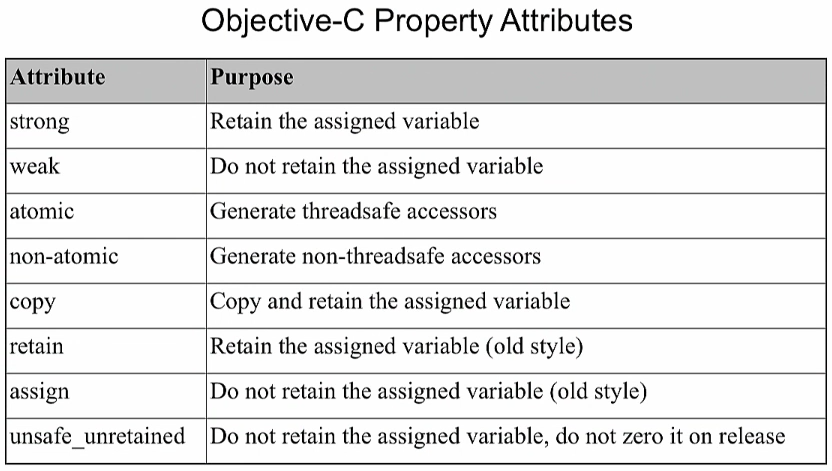

# Objective-C. Классы и объекты.

В Objective-C, когда Вы вызываете метод объекта, то используется специальная терминология - "вы отправляете сообщение ему":

`[someObject doSomething]`

Объект - Сообщение

Т.е. здесь метод как сообщение объекту класса.

## Свойства

позволяют одновременно определить поле класса и методы доступа к нему:

`@property (strong, nonatomic) NSString *foo;`

strong - тип ссылки

nonatomic - поведение методов доступа

далее, как обычно - тип и имя.


В Obj-C __единичное наследование__ - это значит, что все объекты классы наследуют от __единичного корневого объекта__, который называется `NSObject`.

Нет множественного наследования в отличие от С++.

## Префиксы классов

Apple использует двухбуквенные префиксы

```objectivec
NSString *string = ...;
NSArray *array = ...;
CALayer *layer = ...;
```

Вам следует использовать трехбуквенные префиксы

```objectivec
ABCMyClass *myObj = ...;
```

Как аналог множественного наследования используется такая фишка Obj-C, как __протоколы__.

В Objective-C есть __динамическая типизация__ (__утиная типизация__) -

```objectivec
NSString *foo = [NSString string]; // static typing

id bar = [NString string]; // dynamic typing
```

`id` - специальный тип данных, который позволяет объявить объект любого типа и присвоить его в переменную. Это способ реализации утиной типизации. И тогда при соответствии объекта некоторому вызываемому методу, компилятор будет игнорировать, корректен ли этот тип и просто вызывать его:

```objectivec
id foo = [Duck new];

if ([foo respondsToSelector:@selector(quack)])
    NSLog(@"It's a duck!");
```

## Создание объектов

С объектами в Obj-C работают через указатели.

Инициализация объекта в Obj-C - 2-х шаговый процесс:

Шаг 1 - аллоцирование памяти под объект из класса. 

```objectivec
NSMutableString *myString = [[NSMutableString alloc] init];
[myString appendString:@"Objective-C is cool!"];
```

`[NSMutableString alloc]` - это выделение памяти. Затем возвращаемое значение передается для вызова метода `init`. Это метод делает setup выделенной памяти.

Квадратные скобки в Obj-C указывают на сообщения, которые отправляются классам или объектам. 

`[NSMutableString alloc]` - это отправка сообщения `alloc` в `NSMutableString`. Вся операция в квадратных скобках возвращает некоторое значение.

Способ 2: создание `NSMutableString` через фабричный метод:

```objectivec
NSMutableString *anotherString = [NSMutableString stringWithString:@"Objective-C is cool!"];
```

Это эквивалентно двум строкам из первого способа.

Способ 3: создание объекта строки через литерал строки

Такие литералы есть для `NSString`, `NSArray`, `NSDictionary`. (начиная с iOS 6).

```objectivec
NSString *staticString = @"Objective-C is cool!";

NSArray *anArray = @[@"One", @"Two", @"Three"];
NSDictionary *aDict = @{ @"One": @"A", @"Two": "B"};

NSMutableArray *anMutableArray = @[@"One", @"Two", @"Three"] mutableCopy]; 
// но есть и стандартный инициализатор для NSMutableArray
```

### C-строки vs Objective-C строки

C-строкa - это указатель, не имеет методов

* `"This is C string"`
* `NSLog(@"%s", "This is how you print a C String");`
* `["A C string" length];` // ERROR

Objective-C строка - это объект с методами

* `@"Some string"`
* `NSLog(@"%@", @"How to print string");`
* `[@"Some string" length];` // OK

---

ARC - Automatic Reference Counting - компилятор сам освобождает память объектов, если использовать ARC.

ARC - новая фича; если она не используется, то

```objectivec
[myString release]; // нужно, т.к. был применен alloc
[anArray release]; // т.к. было сделано mutableCopy
```

после работы с этими объектами. Для других вышеизложенных объектов это не нужно - они освобождаются автоматически.

## Объявление классов

Класс млекопитающих.

Опять `.h` - файл и `.m` - файл.

`.h` - ТОЛЬКО публичный интерфейс класса (методы и свойства).

`.m` - включает приватные методы и их реализацию тоже.

```objectivec
// Mammal.h
#import <Foundation/Foundation.h>
#import <Cocoa/Cocoa.h>

@interface Mammal : NSObject // имя класса : имя базовых классов;  
    // NSObject - потому что это самый простой базовый класс

// Свойства 
// свойства имеют атрибуты в скобках ()
// по умолчанию свойства имеют weak-ссылки
@property (strong, nonatomic) NSColor *furColor;
@property (nonatomic) float bodyTemperature;
@property (nonatomic, getter = isHappy) BOOL happy;
@property (weak, nonatomic) Mammal *parent;

// Методы
// "-" означает, что это экземплярный метод
// + означает метод класса
// далее - возвращаемое значение
-(void)vocalize;
-(NSArray *)giveLiveBirth;
-(void)nurseYoung:(Mammal *)young; // метод с параметром

// инициализаторы
-(id)init;
-(id)initWithFurColor: (NSColor *)furColor;
-(id)initWithFurColor: (NSColor *)furColor parent:(Mammal *)parent; // это также пример метода с несколькими параметрами

+(id)mammal;

@end
```

В классах нужно реализовать метод `init`, потому что в нем производится аллокация и настройка переменных класса (типа конструктор).


Инициализаторы всегда должны иметь `id` возвращаемый тип.

```objectivec
// Mammal.h

#import "Mammal.h"

@interface Mammal ()
-(BOOL)isMyBaby:(Mammal *)young; // методы закрытой части класса
-(void)feed:(Mammal *)young; // также называются "расширением класса"
@end

@implementation Mammal

-(id)init {
    return [self initWithFurColor:[NSColor brownColor]];
}

-(id)initWithFurColor:(NSColor *)furColor {
    return [self initWithFurColor:furColor parent:nil];
}

// инициализатор с самым большим числом параметров являтся базовым для других инициализаторов
-(id)initWithFurColor:(NSColor *)furColor parent:(Mammal *)parent {
    if ((self = [super init])) {
	    _furColor = furColor;
		_parent = parent;
	}
	
	return self;
}

```




