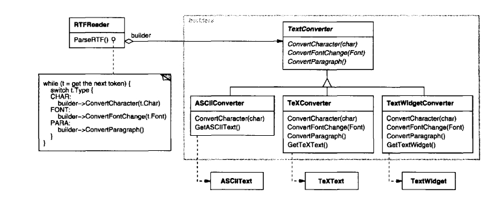
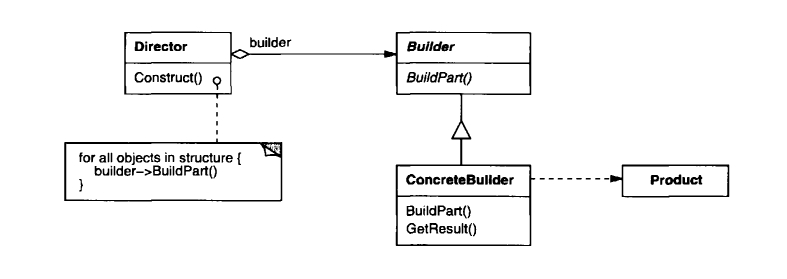
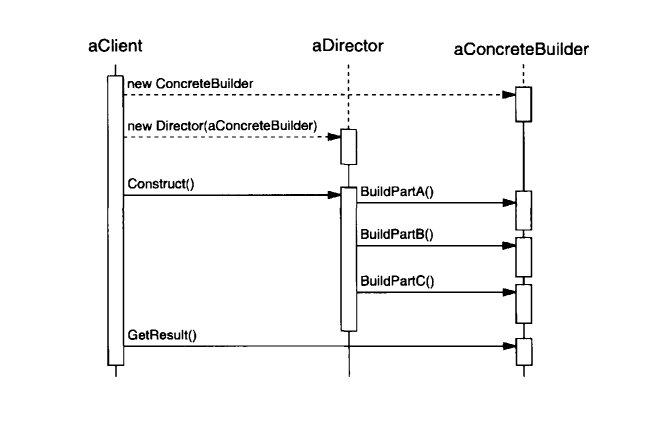

## Паттерн "Строитель"

__*Цель*__: Отделить __конструирование__ сложного объекта от его _репрезентации_ так, чтобы один и тот же процесс __конструирования__ мог создавать различные _репрезентации_.

__*Мотивировка*__ 

Считыватель (reader) RTF документов должен быть способен конвертировать RTF во множество разных форматов. Нужно сделать так, чтобы можно было легко добавить новое преобразование без модификации считывателя.

__Решение__: конфигурировать класс `RTFReader` объектом `TextConvertor`. Объекты `TextConvertor` ответственны и за преобразование данных, и за представление токенов в конкретном формате. 

Производные классы `TextConvertor` специализируются на различных преобразованиях и форматах.



Показанные отношения охватываются паттерном __*Строитель*__. Каждый класс-конвертор называется __*строителем*__ в этом паттерне, а считыватель называется __*директором*__. В данном примере паттерн Строитель отделяет алгоритм интерпретации текстового формата (парсер RTF документов) от того, как создается и репрезентируется сконвертированный формат. Это позволяет использовать алгоритм парсинга RTF для создания различных текстовых репрезентаций на основе исходных RTF документов - просто сконфигурируйте `RTFReader` разными производными классами `TextConvertor`.

_Когда применять паттерн Строитель?_ 

* Если алгоритм с созданием в нем сложного объекта должен быть независим от частей, образующих данный объект и того, как они собираются в целое.

* Процесс конструирования должен допускать различные репрезентации для конструируемого объекта.

### Структура паттерна



Участники:

* __Builder__ (`TextConvertor`) - задаёт абстрактный интерфейс для создания частей объекта `Product`.

* __ConcreteBuilder__ (`ASCIIConverter`, `TeXConverter`, `TextWidgetConverter`) - 
 * конструирует и собирает части __Product__, реализуя интерфейс __Builder__.
 * определяет и отслеживает создаваемые им репрезентации.
 * предоставляет интерфейс для извлечения __Product__ (`GetASCIIText`, `GetTextWidget`).

* __Director__ (`RTFReader`) - конструирует объект, используя интерфейс __Builder__.
* __Product__ (`ASCIIText`, `TeXText`, `TextWidget`) 
 * представляет сложный объект, подлежащий конструированию. __ConcreteBuilder__ строит внутреннюю репрезентацию __Product__ и определяет процесс, по которому он собирается воедино.
 * включает в себя классы, которые определяют составные части, включая интерфейсы для сборки частей воедино для финального результата.

### Совместная работа частей паттерна Строитель

* Клиент создает объект __Director__ и конфигурирует его желаемым объектом __Builder__.
* __Director__ оповещает __Builder__ всякий раз, когда нужно построить часть __Product__.
* __Builder__ обрабатывает запросы от __Director__ и добавляет части к __Product__.
* Клиент извлекает __Product__ у __Builder__.



### Результаты применения паттерна Строитель

* _Можно варьировать внутреннюю репрезентацию_ __Product__. Для этого достаточно определить новый субкласс __Builder__.
* _Код для конструирования и репрезентации изолирован_. Клиенту не нужно ничего знать о классах, определяющих внутреннюю структуру __Product__ - они не явлены в интерфейсе __Builder__. Разные виды директоров __Director__ затем могут использовать один и тот же __Builder__ и его производные.
* _Паттерн_ __*Строитель*__ _даёт более полный контроль над процессом конструирования_. В отличие от порождающих паттернов, конструирующих __Product__ "одним выстрелом", __*Строитель*__ конструирует __Product__ шаг за шагом под контролем __Director__. По завершении построения __Product__ может быть извлечен из __Builder__. Этот паттерн позволяет тщательнее контролировать процесс конструирования и внутреннюю структуру результата в отличие от других паттернов.

### Реализация

Интерфейс для построения лабиринтов:

```csharp
public interface IMazeBuilder {
    void BuildMaze();
    void BuildRoom(int n);
    void BuildDoor(int m, int n);
    Maze GetMaze();
}
```
Позволяет создавать 3 вещи - лабиринты, комнаты, двери между комнатами. Директор:

```charp
public class MazeGame {
    public Maze CreateMaze(IMazeBuilder builder) {
        builder.BuildMaze();
        
        builder.BuildRoom(1);
        builder.BuildRoom(2);
        builder.BuildDoor(1, 2);

        return builder.GetMaze();
    }

    public Maze CreateComplexMaze(IMazeBuilder builder) {
        builder.BuildRoom(1);
        // ...
        builder.BuildRoom(1001);

        return builder.GetMaze();
    }
}
```

```csharp
public class StandardMazeBuilder: IMazeBuilder {
    private Maze _currentMaze;

    // Определяет направление обычной стены между комнатами
    private Direction CommonWall(Room roomA, Room roomB) {
    }

    public void BuildMaze() {
        _currentMaze = new Maze();
    }

    public void BuildRoom(int n) {
        if (_currentMaze.RoomNo(n) == null) {
            Room room = new Room(n);
            _currentMaze.AddRoom(room);

            room.SetSide(North, new Wall());
            room.SetSide(South, new Wall());
            room.SetSide(East, new Wall());
            room.SetSide(West, new Wall());
        }
    }

    public void BuildDoor(int m, int n) {
        Room r1 = _currentMaze.RoomNo(m);
        Room r2 = _currentMaze.RoomNo(n);
        Door d = new Door(r1, r2);

        r1.SetSide(CommonWall(r1, r2), d);
        r2.SetSide(CommonWall(r2, r1), d);
    }

    public Maze GetMaze() {
        return _currentMaze;
    }
}
```

Клиент:

```charp
Maze maze;
MazeGame game = new MazeGame();
StandardMazeBuilder builder = new StandardMazeBuilder();

game.CreateMaze(builder);
maze = builder.GetMaze();
```

### Связанные паттерны

* _Абстрактная Фабрика_ - тоже может конструировать сложные объекты. _Строитель_ делает это шаг за шагом. Абстрактная Фабрика же делает упор на семействах __Product__. Строитель возвращает продукт на последнем шаге, Абстрактная Фабрика - немедленно.

* _Компоновщик_ - это то, построением чего часто занимается _Строитель_.
