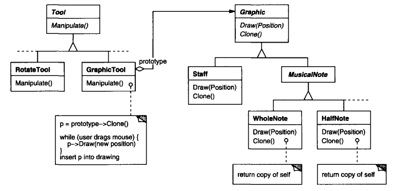
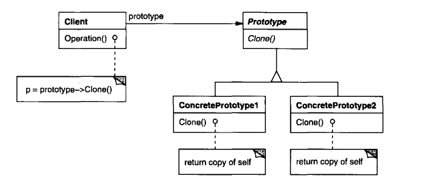

## Паттерн "Прототип" (Prototype)

__Назначение__: Задает виды создаваемых объектов с помощью прототипного экземпляра и создает новые объекты путем копирования этого прототипа.

Паттерн порождения объектов.

__*Мотивировка*__

Построить музыкальный редактор можно путем адаптации общего фреймворка графических редакторов и добавления новых объектов, представляющих ноты, паузы и нотный стан. Палитра инструментов может также содержать инструменты для выбора, перемещения и иных манипуляций с объектами.

Пусть фреймворк предоставляет абстрактный класс `Graphic` для графических компонентов вроде нот и нотных станов, а также абстрактный класс `Tool` для определения инструментов в палитре. Кроме того, имеется подкласс `GraphicTool` для инструментов, которые создают графические объекты и добавляют их в документ.
Однако класс `GraphicTool` создает некую проблему для проектировщика фреймворка. Классы нот и нотных станов специфичны для нашего приложения,
а класс `GraphicTool` принадлежит фреймворку. Этому классу ничего не известно о том, как создавать экземпляры наших музыкальных классов и добавлять их в партитуру. Можно было бы породить от `GraphicTool` подклассы для каждого вида музыкальных объектов, но тогда оказалось бы слишком много классов, отличающихся
только тем, какой музыкальный объект они инстанцируют. Гибкой альтернативой созданию подклассов является композиция. Вопрос в том, как фреймворк мог бы воспользоваться ею для параметризации экземпляров `GraphicTool` классом того объекта `Graphic`, который предполагается создать.

Решение - заставить `GraphicTool` создавать новый графический объект, копируя или "клонируя" экземпляр подкласса класса `Graphic`. Этот экземпляр мы
будем называть прототипом. `GraphicTool` параметризуется прототипом, который он должен клонировать и добавить в документ. Если все подклассы `Graphic`
поддерживают операцию `Clone`, то `GraphicTool` может клонировать любой вид графических объектов.

Итак, в нашем музыкальном редакторе каждый инструмент для создания музыкального объекта - это экземпляр класса `GraphicTool`, инициализированный
тем или иным прототипом. Любой экземпляр `GraphicTool`будет создавать музыкальный объект, клонируя его прототип и добавляя клон в партитуру.
Можно воспользоваться паттерном прототип, чтобы еще больше сократить число классов. Для целых и половинных нот у нас есть отдельные классы, но, быть
может, это излишне. Вместо этого они могли бы быть экземплярами одного и того же класса, инициализированного разными растровыми изображениями и длительностями звучания. Инструмент для создания целых нот становится просто объектом класса `GraphicTool`, в котором прототип `MusicalNote` инициализирован целой нотой. Это может значительно уменьшить число классов в системе. И упрощается добавление нового вида нот в музыкальный редактор.



_Когда применять паттерн Прототип_?
* когда система должна быть независимой от того, как Продукты создаются, как они составлены и как репрезентированы.
* когда инстанцируемые классы задаются во время выполнения (напр., через динамическую загрузку).
* чтобы избежать построения иерархии фабрик, параллельной иерархии классов Продуктов,
* когда экземпляры класса могут иметь одну из немногих разных комбинаций состояния. Может быть более удобным инсталлировать соответствующее число прототипов и клонировать их, чем инстанцировать класс вручную, каждый раз с подходящим состоянием.

### Структура паттерна Прототип



* __Prototype__ (`Graphic`) - интерфейс для клонирования самого себя.
* __ConcretePrototype__ (`Staff`, `WholeNote`, `HalfNote`) - реализует операцию клонирования самого себя.
* __Client__ (`GraphicTool`) - создает новый объект, делая запрос прототипу для клонирования самого себя.

_Совместная работа частей паттерна Прототип_: клиент запрашивает у прототипа клонировать самого себя.

#### Результаты применения паттерна Прототип:

* Сокрытие конкретных классов Продуктов от клиента -> клиенту не нужно знать обо всех них.
* Клиент может работать со специфичными для приложения классами без своей модификации.
* Добавление и удаление Продуктов во время выполнения.
* Задание новых объектов варьированием значений.
* Задание новых объектов варьированием структуры.
* Сокращение числа производных классов.
* Динамическое конфигурирование приложения классами.

### Реализация паттерна Прототип

Паттерн Прототип особенно ценен для не прототипно-ориентированных языков. 

Проблемы, возникающие при реализации паттерна Прототип:
1. Использование _менеджера прототипов_. При не фиксированном количестве прототипов создайте их _реестр_. Клиенты при этом не управляют прототипами сами, а хранят и извлекают их из ассоциативного множества (_реестра_) по ключу.
2. Реализация операции `Clone()`. 
 * Проблема круговых ссылок в структуре объектов мешает корректной реализации операции. Часто требуется иметь глубокую копию, а не shallow-копию.
3. Инициализация клонов объектов.
 * Возможно, необходимо будет ввести операцию `Initialize()`.
 
Мы определим класс `MazePrototypeFactory` - производный от `MazeFactory` - он будет инициализироваться прототипами объектов, которые он будет создавать (см. его конструктор). Его не нужно субклассировать для того, чтобы поменять классы стен или комнат, которые он создает.

Методы для создания стен, дверей и т. д. подобны друг другу: они клонируют прототип, а затем проводят инициализацию:

```charp
public class MazePrototypeFactory: MazeFactory {
    private Maze _prototypeMaze;
    private Wall _prototypeWall;
    private Room _prototypeRoom;
    private Door _prototypeDoor;

    public MazePrototypeFactory(Maze maze, Wall wall, Room room, Door door) {
        _prototypeMaze = maze;
        _prototypeWall = wall;
        _prototypeRoom = room;
        _prototypeDoor = door;
    }

    public Wall MakeWall() {
        return _prototypeWall.Clone();
    }

    public Door MakeDoor(Room room1, Room room2) {
        Door door = _prototypeDoor.Clone();
        door.Initialize(room1, room2);
        return door;
    }
}
```

Использовать `MazePrototypeFactory` можно, инициализировав его прототипы, к примеру, базовыми компонентами лабиринта:

```csharp
MazePrototypeFactory simpleMazeFactory = new MazePrototypeFactory(new Maze(), new Wall(), new Room(), new Door());
```

Для изменения типа лабиринта инициализируем `MazePrototypeFactory` другим набором прототипов:

```csharp
MazePrototypeFactory bombedMazeFactory =
     new MazePrototypeFactory(new Maze(), new BombedWall(), new RoomWithABomb(), new Door());
```

Используемый в качестве прототипа объект должен поддерживать операцию `Clone()`, и, возможно, `Initialize()` для инициализации:

```csharp
public class Door {
    private Room room1;
    private Room room2;

    public Door() {}

    public Door(Door door) {
        room1 = door.room1;
        room2 = door.room2;
    }

    public virtual void Initialize(Room room1, Room room2) {
        this.room1 = room1;
        this.room2 = room2;
    }

    public virtual Door Clone() {
        return new Door(this);
    }

    public virtual void Enter() {}

    public Room OtherSideRoom() { 
        return null;
    }
}
```

Аналогично - `BombedWall` и т.д.

#### Связанные паттерны

_Протитип_ и _Абстрактная Фабрика_ в некоторых случаях являются конкурирующими. Но иногда они могут использоваться совместно - например, _Абстрактная Фабрика_ может хранить набор прототипов, из которых клонировать и возвращать объекты Продуктов.

В проектах с широким использованием _Компоновщика_ и _Декоратора_ зачастую можно также выиграть от применения _Прототипа_.

