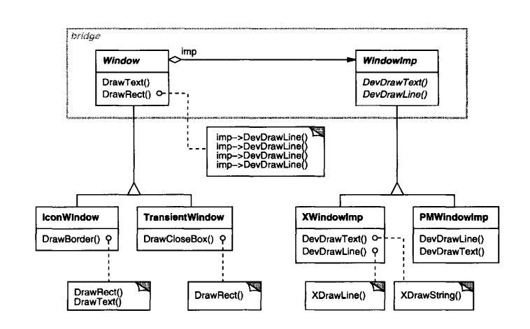

## Паттерн "Мост" (Bridge)

__Назначение__: паттерн структуры объектов; отделяет _абстракцию_ от её _реализации_ таким образом, что они оба могут изменяться независимым образом.

__*Мотивировка*__

Когда _абстракция_ может иметь одну из нескольких _реализаций_, обычный способ работы с ними - использование _наследования_ (в т.ч. наследование (реализация) интерфейсов). Но этот подход не всегда достаточно гибок: наследование жестко связывает абстракцию и реализацию, что усложняет модификацию, расширение и повторное использование абстракций и реализаций независимым образом.

Пример: портируемый на разные платформы UI, абстракция окна `Window`.


_Недостатки_ этого подхода:

* Неудобно расширять абстракцию `Window` для покрытия различных видов окон или новых платформ (см. правую часть рисунка).

* Клиентский код оказывается платформозависимым - клиент всегда инстанцирует конкретный класс с конкретной реализацией. Нужен способ создания объектов окон без непосредственного вызова конкретной реализации.

Паттерн _Мост_ решает эти проблемы, располагая абстракции окна и его реализации в отдельные иерархии классов:



Все операции с производными от `Window` реализованы в терминах абстрактных операций из интерфейса `WindowImp`. Это отделяет абстракции окна от различных платформо-специфичных реализаций. Мы говорим об отношении между `Window` и `WindowImp` как о __*мосте*__.

_Когда применять паттерн Мост_?
* Если вы хотите избежать жесткой привязки между абстракцией и её реализацией. Например, если реализация должна быть выбрана или переключена в момент выполнения.
* Если и абстракции, и их реализации должны быть расширяемы через субклассирование. Паттерн Мост позволит комбинировать разными абстракциями и реализациями и расширять их независимо.
* Если изменения в реализации абстракции не должны сказываться на клиенте.
* Если вы имеете пролиферацию классов как на первой картинке. 
* Если вы хотите сделать _реализацию_ общей среди множества объектов, и этот факт должен быть скрыт от клиента.

### Структура паттерна Мост


Участники:

* __Abstraction__ - интерфейс _абстракции_. Поддерживает ссылку на объект типа `Implementor`.
* __RefinedAbstraction__ - расширяет _абстракцию_.
* __Implementor__ - интерфейс классов _реализации_. Не должен в точности соответствовать интерфейсу _абстракции_ - они могут быть весьма разными. Обычно `Implementor` делает примитивные операции, а `Abstraction` - высокоуровневые на основе этих примитивов.
* __ConcreteImplementor__ - реализация.

_Совместная работа частей паттерна Мост_: __Abstraction__ передаёт клиентские запросы её объекту __Implementor__.

### Реализация паттерна Мост

Класс `Window` определяет _абстракцию_ окна для клиентских приложений:
```csharp
public abstract class Window {
    private IWindowImp _imp;
    protected IWindowImp WindowImp {
        private set {
            _imp = value;
        }
        get {
            if (_imp == null) {
                _imp = WindowSystemFactory.Instance().MakeWindowImp();
            }
            return _imp;
        }
    }
    protected View View { private set; get; }
	
    public Window(View contents) {
	    View = contents;
	}

    public virtual void DrawRect(Point p1, Point p2){
        IWindowImp imp = WindowImp;
        imp.DeviceRect(p1.X, p1.Y, p2.X, p2.Y);
    }

    public virtual void DrawContents() {}

	public virtual void Open(){}
	public virtual void Close(){}
	public virtual void Iconify(){}
	public virtual void Deiconify(){}
	
	public virtual void SetOrigin(Point at){}
	public virtual void SetExtent(Point extent){}
	public virtual void Raise(){}
	public virtual void Lower(){}
	
	public virtual void DrawLine(Point p1, Point p2){}
	public virtual void DrawPolygon(Point[] point, int n){}
	public virtual void DrawText(string s, Point p){}
}
```

`Window` поддерживает ссылку на `IWindowImp` - абстрактный интерфейс для лежащей в основе оконной системы. В свойстве `WindowImp` класса `Window` показан способ получения конкретной реализации через получение экземпляра _Абстрактной Фабрики_.

```charp
public interface IWindowImp {
    void ImpTop();
	void ImpBottom();
	void ImpSetExtent(Point p);
	void ImpSetOrigin(Point p);
	
	void DeviceRect(Coord x0, Coord y0, Coord x1, Coord y1);
	void DeviceText(string s, Coord c1, Coord c2);
	void DeviceBitmap(byte[] b, Coord c1, Coord c2);
}
```

Производные от `Window` классы - это разные виды окон, которые может использовать приложение:

```charp
public class ApplicationWindow : Window {
    public ApplicationWindow(View contents): base(contents) {}

    public override void DrawContents() {
        View.DrawOn(this);
    }
}

public class IconWindow : Window {
    private byte[] _bitmapName;

    public IconWindow(View contents) : base(contents) {}

    public override void DrawContents() {
        IWindowImp imp = WindowImp;
        if (imp != null) {
            imp.DeviceBitmap(_bitmapName, new Coord(), new Coord());
        }
    }
}
```

Конкретные реализации `IWindowImp`:

```charp
public class XWindowImp : IWindowImp {
    private Display _dpy;
    private Drawable _winid;
    private GraphicContext _gc;

    public void DeviceRect(Coord x0, Coord y0, Coord x1, Coord y1) {
        int x = Coord.Min(x0, x1);
        int y = Coord.Min(y0, y1);
        int w = Coord.Abs(x0 - x1);
        int h = Coord.Abs(y0 - y1);
        XDrawRectangle(_dpy, _winid,_gc, x, y, w, h);
    }

    private void XDrawRectangle(Display _dpy, Drawable _winid, GraphicContext _gc, 
        int x, int y, int w, int h) {}

    public void ImpTop() {}
    public void ImpBottom() {}
    public void ImpSetExtent(Point p) {}
    public void ImpSetOrigin(Point p) {}
    public void DeviceText(string s, Coord c1, Coord c2) {}
    public void DeviceBitmap(byte[] b, Coord c1, Coord c2) {}
}

public class PMWindowImp : IWindowImp {
    private HPS _hps;

    public void DeviceRect(Coord x0, Coord y0, Coord x1, Coord y1) {
        // a lot of code with _hps
    }

    public void ImpTop() {}
    public void ImpBottom() {}
    public void ImpSetExtent(Point p) {}
    public void ImpSetOrigin(Point p) {}
    public void DeviceText(string s, Coord c1, Coord c2) {}
    public void DeviceBitmap(byte[] b, Coord c1, Coord c2) {}
}
```

### Связанные паттерны

* _Абстрактная Фабрика_ может создавать и конфигурировать конкретный _Мост_.
* _Адаптер_ приспособлен для того, чтобы сделать несвязанные классы работающими вместе. Обычно его применяют к уже спроектированным системам. _Мост_, с другой стороны, применяется наперед при проектировании, чтобы позволить абстракциям и реализациям изменяться независимо.