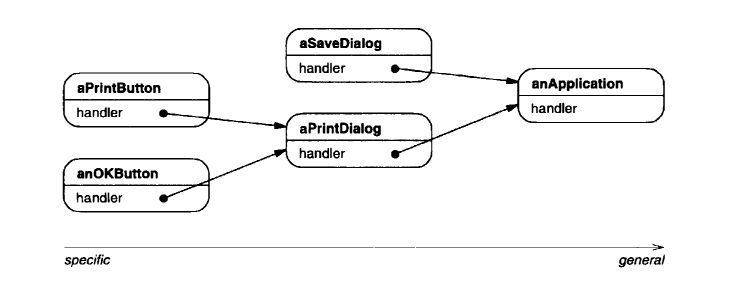
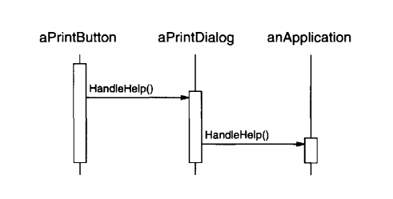
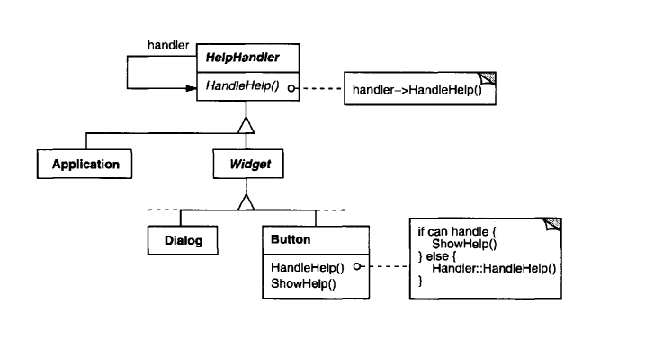
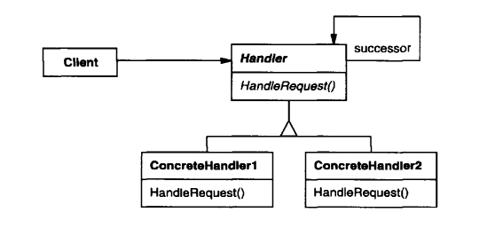
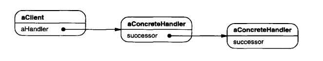

## Паттерн "Цепочка ответственностей" (Chain of Responsibility)

__Назначение__: избежать связывания отправителя запроса с его получателем, давая более чем одному объекту шанс обработать запрос. Делается цепь из объектов-получателей и запрос передается по этой цепи пока некоторый объект не обработает его.

Паттерн _поведения объектов_.

__*Мотивировка*__

Рассмотрим контекстно-зависимую помощь для GUI. Пользователь кликает по элементу интерфейса и получает помощь. Вид информации зависит от выбранного элемента и контекста. Если для элемента нет специфической информации, отображается более общая информация про помощь.

Естественно организовать информацию про помощь по ее общности - от наиболее конкретной к наиболее общей. Запрос помощи обрабатывается __одним из нескольких__ объектов UI - это зависит от контекста и того, насколько специфична доступная информация.

_Проблема_: __объект, который в конечном счете предоставляет помощь__, неизвестен явным образом __объекту__ (напр., кнопке) __инициирующей запрос помощи__. Нам нужен способ устанить сильную связанность между ними. Это делает паттерн.

Идея паттерна в том, чтобы убрать сильную связь между отправителями и получателями, давая нескольким/многим объектам шанс обработать запрос, пока один из них это не сделает.



Первый объект в цепочке получает запрос и либо обрабатывает его, либо передает его следующему кандидату по цепи, который делает то же самое. Делающий запрос объект не имеет явного знания о том, кто будет его обрабатывать - мы говорим, что запрос имеет __неявного получателя__.

Пусть пользователь запрашивает справку по кнопке `Print`. Она находится в диалоговом окне `PrintDialog`, содержащем информацию об объекте приложения, которому принадлежит (см. предыдущую диаграмму объектов). На диаграмме взаимодействий показано, как запрос на получение справки перемещается по цепочке:



В данном случае ни кнопка `aPrintButton`, ни окно `aPrintDialog` не обрабатывают запрос, он достигает объекта `anApplication`, который может его обработать или игнорировать. У клиента, инициировавшего запрос, нет прямой ссылки на объект, который его в конце концов выполнит.

Чтобы отправить запрос по цепочке и гарантировать, что получатель останется неявным, все объекты в цепочке имеют единый интерфейс для обработки запросов и для доступа к своему __последователю__ по цепочке. Например, в системе оперативной справки можно было бы определить класс `HelpHandler` с операцией `HandleHelp()`. Тогда классы, которые будут обрабатывать запрос помощи, могут сделать `HelpHandler` родительским классом.



Для обработки запросов на получение справки классы `Button`, `Dialog` и `Application` пользуются операциями `HelpHandler`. По умолчанию операция `HandleHelp()` просто перенаправляет запрос своему последователю. В подклассах эта операция замещается, так что при соответствующих обстоятельствах может выдаваться справочная информация. В противном случае запрос отправляется дальше посредством реализации по умолчанию.

_Когда применять паттерн Цепочка Ответственности_?

* есть более одного объекта, способного обработать запрос, причем настоящий обработчик заранее неизвестен и должен быть найден автоматически;
* вы хотите отправить запрос одному из нескольких объектов, не задавая получателя явным образом;
* набор объектов, способных обработать запрос, должен задаваться динамически.

### Структура паттерна Цепочка Ответственности



Типичная структура объектов:



Участники:

* __Handler__ (`HelpHandler`) - обработчик,
 * определяет интерфейс для обработки запросов.
 * (опция) реализует связь с последователем.
 
* __ConcreteHandler__ (`PrintButton`, `PrintDialog`)
 - обрабатывает запрос, за который отвечает;
 - имеет доступ к своему последователю;
 - если `ConcreteHandler` способен обработать запрос, то он его обрабатывает, иначе направляет его своему последователю.
 
* __Client__ - инициирует запрос некоторому объекту `ConcreteHandler` в цепочке.

_Совместная работа частей паттерна Цепочка Ответственности_: когда клиент издаёт запрос, этот запрос передается по цепочке, пока один из объектов `ConcreteHandler` не возьмет ответственность за его обработку.

__Результат применения паттерна Цепочка Ответственности:__
* Уменьшение связанности
* Добавление гибкости в присвоении ответственностей объектам
* Нет необходимости в обязательной обработке запроса получателями.

### Реализация паттерна Цепочка Ответственности

Вопросы реализации паттерна Цепочка Ответственности:
* Реализация цепочки последователей
* Соединение последователей (если на них нет заданных заранее ссылок).
* Репрезентация запросов

`HelpHandler` - класс, определяющий интерфейс для обработки запросов справочной информации:

```charp
public enum Topic { NO_HELP_TOPIC = -1 }

public class HelpHandler {
    private HelpHandler _successor;
    private Topic _topic;

    public HelpHandler(HelpHandler h = null, Topic t = Topic.NO_HELP_TOPIC) {
        _successor = h;
        _topic = t;
    }

    public virtual bool HasHelp() {
        return _topic != Topic.NO_HELP_TOPIC;
    }

    public virtual void SetHandler(HelpHandler h, Topic t) {
        _successor = h;
        _topic = t;
    }

    public virtual void HandleHelp() {
        if (_successor != null) {
            _successor.HandleHelp();
        }
    }
}
```

Все виджеты - производные от абстрактного класса `Widget`, который является производным от `HelpHandler`.

```csharp
public abstract class Widget : HelpHandler {
    private Widget _parent;

    protected Widget(Widget parent, Topic t = Topic.NO_HELP_TOPIC): base(parent, t) {
        _parent = parent;
    }
}
```

`Button` - первый обработчик в цепочке в нашем примере. `HandleHelp()` для него сначала проверяет, если помощь для кнопки. 
*Если нет, то запрос передается последователю через вызов `HandleHelp()` класса `HelpHandler`. 
*Если есть, то кнопка отображает эту помощь.

```csharp
public class Button : Widget {
    public Button(Widget d, Topic t = Topic.NO_HELP_TOPIC): base(d, t) {}

    public override void HandleHelp() {
        if (HasHelp()) {
            // offer help on a button
        } else {
            base.HandleHelp();
        }
    }
}
```

`Dialog` работает сходно, но последователем у него является любой обработчик помощи, а не только виджет:

```csharp
public class Dialog : Widget {
    public Dialog(HelpHandler h, Topic t = Topic.NO_HELP_TOPIC): base(null) {
        SetHandler(h, t);
    }

    public override void HandleHelp() {
        if (HasHelp()) {
            // offer help on the dialog
        } else {
            base.HandleHelp();
        }
    }
}
```

В конце цепочки находится экземпляр `Application`:

```csharp
public class Application : HelpHandler {
    public Application(Topic t) : base(null, t) {}

    public override void HandleHelp() {
        // показать список тем в помощи
    }
}
```

Код создания и связывания этих объектов:
```csharp
Application application = new Application(Topic.APPLICATION_TOPIC);
Dialog dialog = new Dialog(application, Topic.PRINT_TOPIC);
Button button = new Button(dialog, Topic.PAPER_ORIENTATION_TOPIC);
```

```csharp
button.HandleHelp();
```

#### Связанные паттерны

_Цепочка Ответственности_ часто применяется в соединении с _Компоновщиком_. Тогда родитель компонента может действовать как его последователь.
