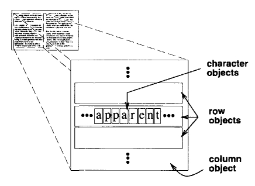
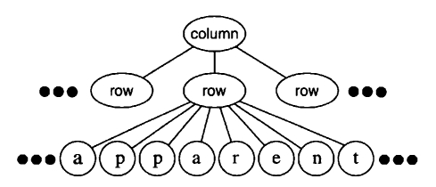
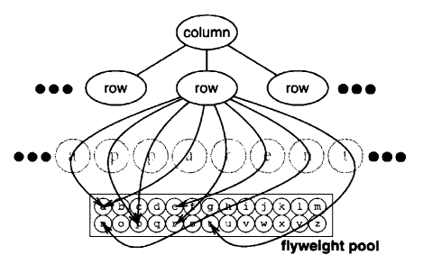
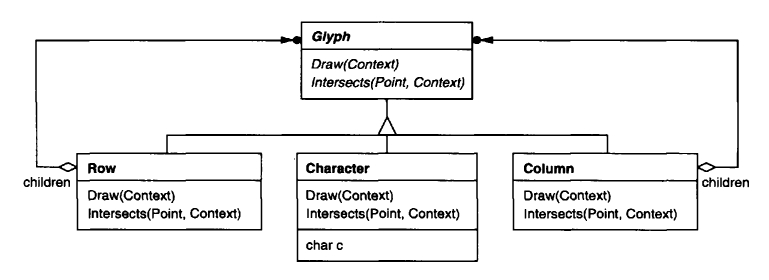
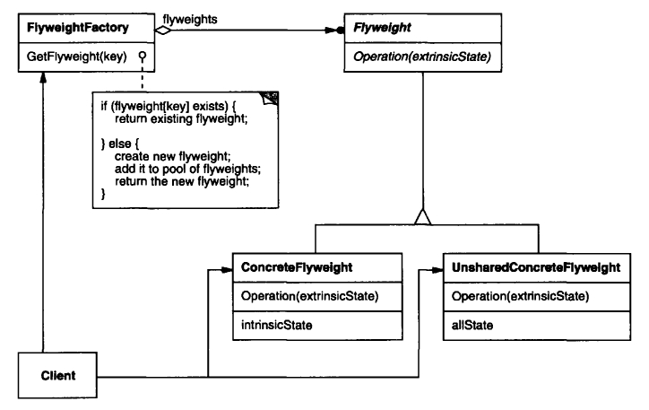
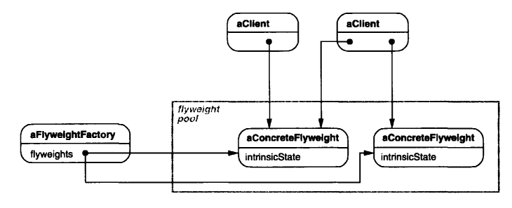
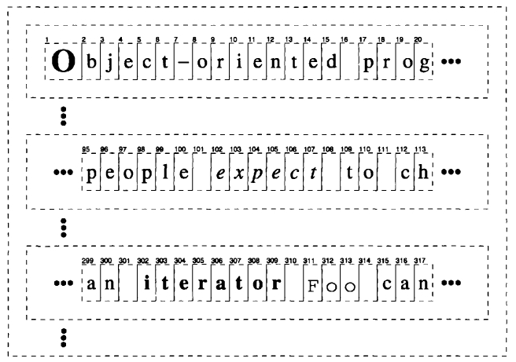

## Паттерн Flyweight / Приспособленец

__Цель паттерна__: использовать _общие разделяемые объекты_ для эффективной поддержки большого количества объектов, состоящих из объектов и т. д. рекурсивно. Паттерн структуры объектов.

__Мотивировка__



__Пример__: текстовый редактор, в котором создаются объекты не только под картинки, таблицы, но и каждый отдельный символ представлен объектом. Тогда сотни тысяч символов - сотни тысяч объектов. Помогает паттерн Приспособленец.

__Приспособленец__ - это разделяемый объект, который может использоваться во множестве _контекстов_ одновременно.
* _Приспособленец_ действует как независимый объект в каждом контексте - он неотличим от экземпляра объекта, не являющегося разделяемым.
* _Приспособленец_ не может делать предположений о контексте, в котором он функционирует. Ключевой идеей здесь является различение __внутреннего__ и __внешнего__ состояний.
 * __внутреннее состояние__ хранится в _Приспособленце_. Оно содержит информацию, независимую от контекста приспособленца, таким образом делая его разделяемым.
 * __внешнее состояние__ зависит от контекста и не является разделяемым. Клиент отвечает за передачу Приспособленцу внешнего состояния, если это нужно.
 
Логически мы имеем объект для каждого вхождения данного символа в документ:


Физически же есть один разделяемый объект приспособленца на каждый символ, в разных контекстах:


Структура классов для этих объектов: `Glyph` - абстрактный класс для графических объектов, некоторые из которых могут быть _приспособленцами_. Операции, которые могут зависеть от внешнего состояния, получают его в качестве параметра (`Draw()`, `Intersects()`).



__Когда применять паттерн Приспособленец__ - если верны _ВСЕ_ из утверждений:
* Приложение использует большое количество объектов; стоимость их хранения высока.
* Большая часть состояния объекта может быть сделана _внешней_.
* Многие из групп объектов могут быть заменены относительно немногими разделяемыми объектами после удаления _внешнего состояния_.
* В приложении нет необходимости различать каждый объект индивидуально.

### Структура паттерна Приспособленец



Диаграмма объектов, показывающая, как приспособленцы разделяются:



* __Flyweight__ (`Glyph`) - объявляет интерфейс, через который приспособленцы могут получать _внешнее состояние_ и работать с ним.
* __ConcreteFlyweight__ (`Character`) - реализует __Flyweight__, хранит внутреннее состояние (если есть). Объект это типа должен быть разделяем и не зависеть от контекста.
* __UnsharedConcreteFlyweight__ (`Row`, `Column`) - неразделяемый подкласс __Flyweight__. У объектов __UnsharedConcreteFlyweight__ объекты __ConcreteFlyweight__ часто являются дочерними в структуре объектов-приспособленцев.
* __FlyweightFactory__ 
 * создает и управляет объектами приспособленцев.
 * обеспечивает правильное разделение приспособленцев.
* __Сlient__ 
 * поддерживает ссылку на приспособленца(-ев).
 * вычисляет или хранит внешнее состояние приспособленца(-ев).
 
__*Совместная работа частей паттерна Приспособленец*__:
* _Внутреннее состояние_ хранится в объекте __ConcreteFlyweight__, _внешнее_ - хранится или вычисляется объектами __Client__. Клиенты передают это состояние приспособленцу, когда вызывают его операции.
* Инстанцирование объектов приспособленцев осуществляет __FlyweightFactory__.

__*Результаты применения паттерна Приспособленец*__:
* Сбережение пространства памяти.

### Реализация

1. Нужно устранить внешнее состояние из разделяемых объектов.
2. Проблема управления разделяемыми объектами. Для этого применяется __FlyweightFactory__.

`Glyph` - базовый класс для графических объектов приспособленцев. Логически глифы являются _Компоновщиками_, имеющими графические атрибуты и умеющими рисовать себя. Здесь мы, чисто для примера, сфокусируемся на атрибуте `font`.

```charp
public abstract class Glyph {
    protected Glyph() {}
    
    public abstract void Draw(Window window, GlyphContext context);
    public abstract void SetFont(Font font, GlyphContext context);
    public abstract Font GetFont(GlyphContext context);
    
    public abstract void First(GlyphContext context);
    public abstract void Next(GlyphContext context);
    public abstract bool IsDone(GlyphContext context);
    public abstract Glyph Current(GlyphContext context);

    public abstract void Insert(Glyph glyph, GlyphContext context);
    public abstract void Remove(GlyphContext context);
}

```

Подкласс `Character` просто хранит код символа

```charp
public class Character: Glyph {
    private char _charCode;

    public Character(char c) { }
    public override void Draw(Window window, GlyphContext context) { }
    public override void SetFont(Font font, GlyphContext context) { }
    public override Font GetFont(GlyphContext context) { throw new System.NotImplementedException(); }
    public override void First(GlyphContext context) {}
    public override void Next(GlyphContext context) {}
    public override bool IsDone(GlyphContext context) { throw new System.NotImplementedException(); }
    public override Glyph Current(GlyphContext context) { return null; }
    public override void Insert(Glyph glyph, GlyphContext context) { }
    public override void Remove(GlyphContext context) { }
}
```

Чтобы не выделять пространство памяти для атрибута font в каждом глифе, этот атрибут будет храниться вовне в объекте `GlyphContext` (репозитории внешнего состояния). Он поддерживает компактное отображение между глифом и его шрифтом в разных контекстах.

```charp
public class GlyphContext {
    private int _index;
    private BTree _fonts;
    
    public GlyphContext() { }
    public virtual void Next(int step = 1) { }
    public virtual void Insert(int quantity = 1) { }
    public virtual Font GetFont() { return null; }
    public virtual void SetFont(Font font, int span = 1);
}
```



Структура BTree для шрифтовой информации может выглядеть так:

